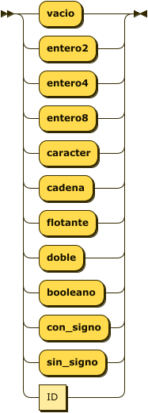
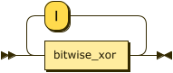
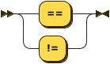
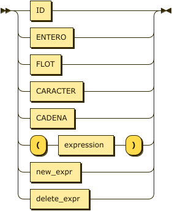
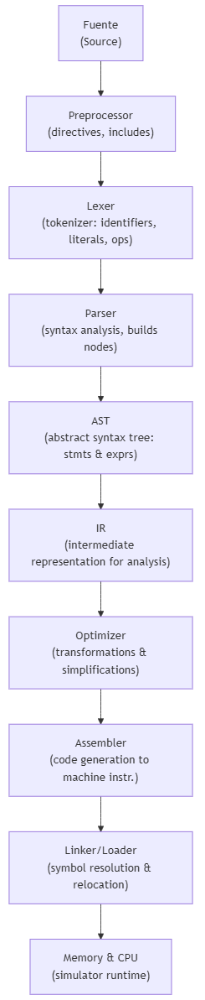

\newpage

# 1. Marco Teórico

## 1.1 Arquitectura de Computadores y Modelo von Neumann

El diseño de computadores modernos se fundamenta en los principios establecidos por John von Neumann en 1945, quien propuso una arquitectura en la cual las instrucciones y los datos se almacenan en una memoria común y se ejecutan secuencialmente bajo el control de una unidad central de procesamiento (CPU). Este modelo, conocido como **arquitectura von Neumann**, constituye la base conceptual de prácticamente todos los computadores actuales.

### 1.1.1 Componentes Fundamentales

La arquitectura von Neumann se compone de cinco componentes principales:

**1. Unidad Central de Procesamiento (CPU)**:
- **ALU (Unidad Aritmético-Lógica)**: Realiza operaciones aritméticas (suma, resta, multiplicación, división) y lógicas (AND, OR, NOT, XOR)
- **Unidad de Control**: Coordina y sincroniza todas las operaciones del sistema, decodifica instrucciones y genera señales de control
- **Registros**: Almacenamiento interno de alta velocidad para datos temporales, direcciones e instrucciones
- **PC (Program Counter)**: Registro que mantiene la dirección de la siguiente instrucción a ejecutar
- **Registro de Flags**: Almacena indicadores de estado como Zero (Z), Negative (N), Carry (C), Overflow (V)

**2. Memoria Principal**:
- Almacenamiento de acceso aleatorio (RAM) que contiene tanto instrucciones como datos
- Organizada en celdas direccionables, cada una identificada por una dirección única
- En arquitecturas modernas, típicamente organizada en bytes (8 bits)

**3. Sistema de Entrada/Salida (E/S)**:
- Dispositivos periféricos para comunicación con el exterior (teclado, pantalla, disco, red)
- Controladores que gestionan la transferencia de datos entre CPU y dispositivos

**4. Buses del Sistema**:
- **Bus de Datos**: Transporta información (instrucciones y datos) entre componentes, bidireccional
- **Bus de Direcciones**: Transmite direcciones de memoria o dispositivos, unidireccional desde CPU
- **Bus de Control**: Lleva señales de control (lectura, escritura, reloj, interrupciones)

**5. Unidad de Punto Flotante (FPU)**:
- Componente especializado (puede estar integrado o separado) para operaciones con números reales
- Implementa aritmética IEEE 754 para tipos float y double

### 1.1.2 Ciclo de Instrucción (Fetch-Decode-Execute)

El procesador ejecuta programas mediante un ciclo repetitivo de tres fases:

1. **Fetch (Búsqueda)**:
   - Leer la instrucción desde memoria[PC]
   - Copiar la instrucción al registro de instrucción (IR)
   - Incrementar PC para apuntar a la siguiente instrucción

2. **Decode (Decodificación)**:
   - La unidad de control analiza el opcode de la instrucción
   - Identifica la operación a realizar
   - Extrae los operandos (registros, inmediatos, direcciones de memoria)

3. **Execute (Ejecución)**:
   - La ALU/FPU realiza la operación especificada
   - Se actualizan registros, memoria y/o flags según corresponda
   - Para instrucciones de salto, se modifica el PC

Este ciclo se repite continuamente hasta que el programa termina o se encuentra una instrucción de detención (HALT).

### 1.1.3 Arquitectura Atlas (64 bits)

En este proyecto se ha diseñado e implementado la arquitectura **Atlas**, un computador de 64 bits que sigue el modelo von Neumann con las siguientes características:

**Especificaciones técnicas**:
- **Tamaño de palabra**: 64 bits (8 bytes)
- **Direccionamiento**: Por byte (cada dirección referencia 1 byte)
- **Espacio de direcciones**: 44 bits de direccionamiento (16 TiB teóricos, 64 KB implementados)
- **Registros de propósito general**: 16 registros (R00-R15), cada uno de 64 bits
- **Registros especiales**:
  - R14: BP (Base Pointer) para gestión de stack frames
  - R15: SP (Stack Pointer) para tope de pila
- **Registro de flags**: 4 bits (Z, N, C, V)
- **Conjunto de instrucciones**: 137+ instrucciones (ISA)

**Organización de memoria**:
- **Segmento de código**: Desde 0x0000, contiene instrucciones del programa
- **Segmento de datos globales**: Desde 0x1000, variables globales y constantes
- **Segmento de stack**: Desde 0x8000, crece hacia direcciones mayores

**Formatos de instrucción**:
- **OP**: Operación sin operandos (ej: HALT, RET, NOP)
- **R**: Un operando registro (ej: PUSH8 R01)
- **RR**: Dos operandos registro (ej: ADD8 R01, R02)
- **RI**: Registro e inmediato (ej: LOADV4 R01, 100)
- **I**: Solo inmediato o dirección (ej: JMP 0x1000, CALL funcion)

**Sufijos de tamaño**: Las instrucciones incluyen sufijos que indican el tamaño de operación:
- `1`: 1 byte (8 bits)
- `2`: 2 bytes (16 bits)
- `4`: 4 bytes (32 bits)
- `8`: 8 bytes (64 bits)
- Ejemplo: `ADD1`, `ADD2`, `ADD4`, `ADD8`

**Soporte de punto flotante**: Instrucciones con prefijo `F` para operaciones flotantes:
- `FADD4`, `FSUB4`, `FMUL4`, `FDIV4`: Operaciones de 32 bits (float)
- `FADD8`, `FSUB8`, `FMUL8`, `FDIV8`: Operaciones de 64 bits (double)

**Sistema de E/S**:
- E/S mapeada en memoria (memory-mapped I/O)
- Dispositivos accesibles mediante instrucciones de carga/almacenamiento estándar
- Instrucciones especializadas: SVIO (guardar), LDIO (cargar), SHOWIO (visualizar)

## 1.2 Lenguaje Ensamblador

El lenguaje ensamblador es un lenguaje de programación de bajo nivel que utiliza **mnemónicos** (abreviaturas legibles) para representar instrucciones de código máquina. Cada instrucción en ensamblador corresponde típicamente a una instrucción binaria ejecutable por el procesador.

### 1.2.1 Características del Lenguaje Ensamblador

**Ventajas**:
- Control preciso sobre el hardware y recursos del sistema
- Optimización máxima del rendimiento y uso de memoria
- Acceso directo a registros, memoria y dispositivos E/S
- Ideal para programación de sistemas, drivers y código crítico

**Desventajas**:
- Específico de cada arquitectura (no portable)
- Complejidad mayor que lenguajes de alto nivel
- Mayor propensión a errores
- Desarrollo y mantenimiento más costoso

### 1.2.2 Elementos del Lenguaje Ensamblador Atlas

**Instrucciones**: Mnemónicos que representan operaciones del procesador
```assembly
LOAD8 R01, [0x1000]    ; Cargar 8 bytes desde memoria
ADD4 R01, R02          ; Sumar dos registros (32 bits)
JZ etiqueta            ; Saltar si flag Zero está activo
```

**Etiquetas**: Identificadores simbólicos para direcciones de memoria
```assembly
inicio:
    LOADV4 R01, 10
    JMP loop
loop:
    ...
```

**Directivas del ensamblador**: Comandos para el ensamblador (no generan código)
```assembly
.data                   ; Sección de datos
.text                   ; Sección de código
.global main           ; Símbolo exportado
```

**Comentarios**: Documentación del código (ignorada por el ensamblador)
```assembly
; Comentario de línea completa
LOAD8 R01, [0x1000]    ; Comentario al final de línea
```

### 1.2.3 Proceso de Ensamblado

El ensamblador traduce código ensamblador a código máquina mediante **dos pasadas**:

**Primera pasada**:
1. Construir tabla de símbolos con direcciones de todas las etiquetas
2. Calcular tamaños de instrucciones y datos
3. Asignar direcciones a cada instrucción y dato
4. Detectar errores sintácticos básicos

**Segunda pasada**:
1. Generar código binario para cada instrucción
2. Resolver referencias a etiquetas (sustituir por direcciones)
3. Marcar símbolos externos para el enlazador
4. Generar archivo objeto (.o) con código, símbolos y relocaciones

## 1.3 Compiladores y Procesamiento de Lenguajes

Un **compilador** es un programa traductor que convierte código escrito en un lenguaje de programación de alto nivel (lenguaje fuente) a un lenguaje de nivel inferior (lenguaje objetivo), típicamente lenguaje ensamblador o código máquina. A diferencia del lenguaje ensamblador que es de bajo nivel y específico de arquitectura, los lenguajes de alto nivel ofrecen abstracciones que facilitan el desarrollo de software complejo.

### 1.3.1 Lenguajes de Alto Nivel vs. Bajo Nivel

**Lenguajes de alto nivel** (ej: C, Java, Python, SPL):
- Abstracciones: variables, funciones, estructuras de control, tipos de datos complejos
- Independencia de la arquitectura (portabilidad)
- Mayor productividad del programador
- Expresividad y legibilidad mejoradas

**Lenguajes de bajo nivel** (ensamblador, código máquina):
- Mapeo directo a instrucciones del procesador
- Control fino sobre hardware
- Máximo rendimiento y eficiencia
- Específicos de cada arquitectura

El compilador actúa como **puente** entre ambos niveles, permitiendo programar con abstracciones de alto nivel mientras genera código eficiente de bajo nivel.

### 1.3.2 Fases de un Compilador

El proceso de compilación se organiza en múltiples fases que procesan progresivamente el código fuente:

**Front-end (Análisis)** - Procesa el código fuente y verifica su validez:
1. **Preprocesador**: Expansión de macros, inclusión de archivos, procesamiento de directivas
2. **Análisis Léxico**: Conversión del código fuente en secuencia de tokens
3. **Análisis Sintáctico**: Verificación de la estructura gramatical y construcción del AST
4. **Análisis Semántico**: Validación de tipos, scopes y reglas semánticas

**Back-end (Síntesis)** - Genera código ejecutable optimizado:
5. **Generación de Código Intermedio**: Representación independiente de la arquitectura
6. **Optimización**: Mejora de eficiencia (eliminación de código muerto, propagación de constantes, etc.)
7. **Generación de Código**: Traducción a lenguaje ensamblador de la arquitectura objetivo
8. **Ensamblado y Enlazado**: Producción del ejecutable final

### 1.3.3 Herramientas para Construcción de Compiladores

Existen herramientas especializadas que automatizan la generación de componentes del compilador:

**Lex/Flex** (generadores de analizadores léxicos):
- Entrada: Especificación de tokens mediante expresiones regulares
- Salida: Código C que implementa el analizador léxico

**Yacc/Bison** (generadores de analizadores sintácticos):
- Entrada: Gramática libre de contexto en notación BNF
- Salida: Código C que implementa el parser LALR(1)

**PLY (Python Lex-Yacc)**: Implementación en Python de Lex y Yacc desarrollada por David Beazley:
- **PLY Lex**: Generador de analizadores léxicos basado en expresiones regulares
- **PLY Yacc**: Generador de parsers LALR(1) basado en gramáticas libres de contexto
- **Ventajas**: 
  - Integración nativa con Python (sin archivos intermedios)
  - Debugging facilitado mediante trazas y mensajes de error claros
  - Documentación completa y comunidad activa
  - Soporte para Unicode

## 1.4 Preprocesador

El preprocesador es una herramienta que actúa **antes** del compilador principal, transformando el código fuente mediante expansión textual de directivas especiales. El preprocesamiento es una fase de transformación sintáctica que no analiza la semántica del lenguaje.

### 1.4.1 Directivas de Inclusión (#include)

Permiten incorporar contenido de archivos externos, facilitando la modularización y reutilización de código:

```assembly
#include "lib/io.asm"     ; Incluir biblioteca de E/S
#include "lib/math.asm"   ; Incluir funciones matemáticas
```

**Funcionamiento**:
1. El preprocesador busca el archivo en rutas configuradas (. , ./lib, etc.)
2. Lee el contenido completo del archivo
3. Inserta el contenido en el punto exacto de la directiva
4. Procesa recursivamente los #include dentro del archivo incluido

**Ventajas**:
- Separación de código en módulos reutilizables (bibliotecas)
- Organización lógica del proyecto
- Evita duplicación de código común

### 1.4.2 Definiciones de Constantes (#define)

Permiten asignar nombres simbólicos a valores constantes:

```assembly
#define IO_BASE 0x100
#define MAX_SIZE 1024
#define PI 3.14159265359
```

El preprocesador reemplaza todas las ocurrencias del identificador por su valor antes de la compilación.

### 1.4.3 Macros con Parámetros

Las macros permiten definir patrones de código que se expanden con sustitución de parámetros:

```assembly
.macro PRINT_REG reg, addr
    SVIO reg, addr
    SHOWIO addr
.endmacro

; Uso:
PRINT_REG R01, 0x100
```

**Expansión** (lo que ve el ensamblador):
```assembly
SVIO R01, 0x100
SHOWIO 0x100
```

**Ventajas**:
- Reducción de código repetitivo
- Abstracción de patrones comunes
- Mantenibilidad (cambio único en la definición)

## 1.5 Análisis Léxico

El análisis léxico es la **primera fase** del front-end del compilador, responsable de leer el código fuente como flujo de caracteres y agruparlos en unidades léxicas significativas llamadas **tokens**. También se conoce como **scanner** o **lexer**.

### 1.5.1 Tokens y Categorías Léxicas

Un **token** es una tupla que representa una unidad léxica: **(tipo, valor, línea, columna)**

Ejemplo:
```
Código:    int x = 42;

Tokens:    (KEYWORD, 'int', 1, 1)
           (IDENTIFIER, 'x', 1, 5)
           (ASSIGN, '=', 1, 7)
           (INTEGER, 42, 1, 9)
           (SEMICOLON, ';', 1, 11)
```

**Categorías léxicas típicas**:

1. **Palabras reservadas**: Identificadores con significado especial en el lenguaje
   - Ejemplos: `function`, `if`, `else`, `while`, `for`, `return`, `struct`, `new`, `delete`, `int`, `float`

2. **Identificadores**: Nombres definidos por el programador para variables, funciones, tipos
   - Patrón: Letra o `_` seguido de letras, dígitos o `_`
   - Ejemplos: `miVariable`, `calcularArea`, `Persona_t`

3. **Literales**: Valores constantes
   - Enteros: `42`, `0xFF`, `0b1010`
   - Flotantes: `3.14`, `2.5e-3`, `1.0f`
   - Cadenas: `"Hola mundo"`
   - Caracteres: `'a'`, `'\n'`
   - Booleanos: `true`, `false`

4. **Operadores**: Símbolos que denotan operaciones
   - Aritméticos: `+`, `-`, `*`, `/`, `%`
   - Relacionales: `<`, `>`, `<=`, `>=`, `==`, `!=`
   - Lógicos: `&&`, `||`, `!`
   - Bitwise: `&`, `|`, `^`, `~`, `<<`, `>>`
   - Asignación: `=`, `+=`, `-=`, `*=`, `/=`
   - Punteros: `*`, `&`
   - Miembro: `.`, `->`

5. **Delimitadores**: Símbolos de puntuación y agrupación
   - Paréntesis: `(`, `)`
   - Llaves: `{`, `}`
   - Corchetes: `[`, `]`
   - Punto y coma: `;`
   - Coma: `,`
   - Dos puntos: `:`

6. **Comentarios**: Texto informativo ignorado por el compilador
   - Línea: `// comentario`
   - Bloque: `/* comentario multilínea */`

### 1.5.2 Expresiones Regulares y Reconocimiento de Patrones

El reconocimiento de tokens se basa en **expresiones regulares** que describen patrones de caracteres:

| Categoría | Expresión Regular | Ejemplos |
|-----------|-------------------|----------|
| Identificador | `[a-zA-Z_][a-zA-Z0-9_]*` | `var`, `_temp`, `calcTotal` |
| Entero decimal | `[0-9]+` | `0`, `42`, `1000` |
| Hexadecimal | `0[xX][0-9a-fA-F]+` | `0xFF`, `0x10` |
| Binario | `0[bB][01]+` | `0b1010`, `0B11` |
| Flotante | `[0-9]+\.[0-9]+([eE][+-]?[0-9]+)?` | `3.14`, `2.5e-3` |
| Cadena | `"([^"\\]|\\.)*"` | `"texto"`, `"line\n"` |
| Carácter | `'([^'\\]|\\.)'` | `'a'`, `'\t'` |

### 1.5.3 Autómatas Finitos

Las expresiones regulares se implementan mediante **Autómatas Finitos Determinísticos (DFA)** que procesan el flujo de caracteres de manera eficiente:

```
Ejemplo: Reconocer identificador [a-zA-Z_][a-zA-Z0-9_]*

    [a-zA-Z_]         [a-zA-Z0-9_]
(q0) ---------> ((q1)) ----------> ((q1))
inicio          aceptación         aceptación
                (identificador)    (más caracteres)
```

El DFA lee caracteres secuencialmente, transita entre estados y acepta cuando llega a un estado final.

### 1.5.4 Implementación con PLY Lex

En PLY, los tokens se definen mediante funciones Python con expresiones regulares en docstrings:

```python
import ply.lex as lex

# Lista de tokens
tokens = ['IDENTIFIER', 'INTEGER', 'PLUS', 'LPAREN', 'RPAREN']

# Palabras reservadas
reserved = {'if': 'IF', 'else': 'ELSE', 'while': 'WHILE'}
tokens += list(reserved.values())

# Reglas de tokens (expresiones regulares)
t_PLUS = r'\+'
t_LPAREN = r'\('
t_RPAREN = r'\)'

def t_IDENTIFIER(t):
    r'[a-zA-Z_][a-zA-Z0-9_]*'
    t.type = reserved.get(t.value, 'IDENTIFIER')  # Verificar palabra reservada
    return t

def t_INTEGER(t):
    r'\d+'
    t.value = int(t.value)
    return t

# Caracteres ignorados (espacios, tabs)
t_ignore = ' \t'

# Manejo de saltos de línea
def t_newline(t):
    r'\n+'
    t.lexer.lineno += len(t.value)

# Manejo de errores
def t_error(t):
    print(f"Carácter ilegal '{t.value[0]}' en línea {t.lineno}")
    t.lexer.skip(1)

# Construir el lexer
lexer = lex.lex()
```

## 1.6 Análisis Sintáctico y Gramáticas

El análisis sintáctico es la **segunda fase** del compilador y verifica que la secuencia de tokens producida por el lexer cumple con las **reglas gramaticales** del lenguaje. Si el análisis léxico trabaja con patrones lineales (expresiones regulares), el análisis sintáctico maneja **estructuras jerárquicas** y anidadas que requieren gramáticas más potentes.

### 1.6.1 Gramáticas Libres de Contexto (GLC)

Una gramática libre de contexto se define como **G = (V, T, R, S)**:

- **V**: Símbolos no terminales (construcciones del lenguaje)
- **T**: Símbolos terminales (tokens)
- **R**: Reglas de producción **A → alfa**
- **S**: Símbolo inicial

**Notación E-BNF** (Extended Backus-Naur Form) extiende BNF con operadores de repetición y opcionalidad:

| Operador | Significado | Ejemplo |
|----------|-------------|---------|
| `?` | Opcional (0 o 1) | `param_list?` |
| `*` | Repetición (0+) | `statement*` |
| `+` | Repetición (1+) | `declaration+` |
| `\|` | Alternativa | `type \| void` |
| `( )` | Agrupación | `('+' \| '-')` |

**Ejemplo de gramática E-BNF para expresiones aritméticas**:
```ebnf
expression ::= term (('+' | '-') term)*
term ::= factor (('*' | '/') factor)*
factor ::= INTEGER | IDENTIFIER | '(' expression ')'
```

### 1.6.2 Árboles de Sintaxis Abstracta (AST)

El AST es una representación intermedia que:

- Elimina detalles sintácticos irrelevantes (paréntesis, punto y coma)
- Preserva la estructura semántica del programa
- Facilita análisis semántico y generación de código
- Permite optimizaciones mediante transformaciones del árbol

**Ejemplo**:
```
Código:  x = a + b * c;

AST:     Assignment
         ├─ target: Identifier(x)
         └─ value: BinaryOp(+)
            ├─ left: Identifier(a)
            └─ right: BinaryOp(*)
               ├─ left: Identifier(b)
               └─ right: Identifier(c)
```

### 1.6.3 Precedencia y Asociatividad de Operadores

Para evitar ambigüedades en expresiones, se definen reglas de precedencia (orden de evaluación) y asociatividad (dirección de agrupación):

| Precedencia | Operador | Asociatividad | Ejemplo |
|-------------|----------|---------------|---------|
| 1 (mayor) | `[]`, `()`, `.` | Izquierda | `a[i].x` |
| 2 | `!`, `~`, `*` (puntero), `&` (dirección) | Derecha | `*ptr` |
| 3 | `*`, `/`, `%` | Izquierda | `a * b / c` |
| 4 | `+`, `-` | Izquierda | `a + b - c` |
| 5 | `<`, `>`, `<=`, `>=` | Izquierda | `a < b` |
| 6 | `==`, `!=` | Izquierda | `a == b` |
| 7 | `&&` | Izquierda | `a && b` |
| 8 | `\|\|` | Izquierda | `a \|\| b` |
| 9 (menor) | `=`, `+=`, `-=` | Derecha | `a = b = c` |

## 1.7 Análisis Semántico

El análisis semántico es la **tercera fase** del compilador y verifica la corrección del programa más allá de su sintaxis, validando reglas que no pueden expresarse mediante gramáticas libres de contexto. Mientras que el análisis sintáctico verifica la **forma** del programa, el análisis semántico verifica el **significado**.

### 1.7.1 Tabla de Símbolos

La tabla de símbolos es una estructura de datos fundamental que almacena información sobre todos los identificadores (variables, funciones, tipos, constantes) usados en el programa:

**Información almacenada por símbolo**:
- **Nombre**: Identificador único en su scope
- **Tipo**: Tipo de dato (primitivo, estructura, puntero, arreglo)
- **Categoría**: Variable, función, parámetro, constante, tipo
- **Alcance**: Global, local (función), bloque, estructura
- **Offset/Dirección**: Ubicación en memoria o stack frame
- **Atributos**: Inicializado, constante, externo

**Gestión de scopes anidados**: Los lenguajes estructurados en bloques requieren múltiples tablas organizadas en pila:

```
Scope Global
├─ var x: int4
├─ function f(a: int4)
│  ├─ Scope de función f
│  │  ├─ param a: int4
│  │  ├─ local b: float
│  │  └─ if-block
│  │     └─ Scope del bloque if
│  │        └─ local c: int2
```

**Reglas de resolución de nombres**:
1. Buscar en scope actual
2. Si no se encuentra, buscar en scope padre
3. Continuar hasta scope global
4. Error si no se encuentra en ningún scope

### 1.7.2 Sistema de Tipos

El sistema de tipos define qué operaciones son válidas y cómo se comportan:

1. **Tipos primitivos**: `int2`, `int4`, `int8`, `float`, `double`, `char`, `bool`, `void`
2. **Tipos compuestos**: Punteros (`*type`), estructuras (`struct`), arreglos (`type[]`)
3. **Compatibilidad de tipos**: Qué operaciones son válidas entre qué tipos
4. **Conversiones implícitas**: Promoción automática (ej: `int4` → `float`)
5. **Equivalencia estructural**: Para structs, comparar estructura de campos

**Verificaciones semánticas típicas**:
- Variables declaradas antes de uso
- Tipos compatibles en asignaciones y operaciones
- Número y tipo correcto de argumentos en llamadas a función
- Funciones no-void deben retornar un valor
- Break/continue solo dentro de loops
- Return solo dentro de funciones
- No redeclaración de símbolos en el mismo scope
- Acceso a miembros solo en estructuras
- Operaciones de punteros solo con tipos puntero

### 1.7.3 Inferencia y Coerción de Tipos

**Conversiones implícitas (coerción)**:
```
int4 + float   →  float + float   (promoción de int4 a float)
int2 = int4    →  int2 = (int2)int4  (truncamiento)
```

**Reglas de promoción** (de menor a mayor):
```
int2 → int4 → int8 → float → double
```

## 1.8 Generación de Código

La generación de código es la **cuarta fase** del compilador y traduce el AST validado semánticamente a código ensamblador de la arquitectura objetivo (Atlas). Esta es la fase de **síntesis** donde se produce el código de salida.

### 1.8.1 Asignación de Registros y Memoria

**Estrategias de asignación**:

1. **Registros temporales**: R00-R09 se usan para evaluar expresiones intermedias
   ```
   x = a + b * c;
   
   R00 = b
   R01 = c
   R02 = R00 * R01    ; b * c
   R03 = a
   R04 = R03 + R02    ; a + (b * c)
   [x] = R04
   ```

2. **Registros especiales**: 
   - R14: BP (Base Pointer) - base del stack frame actual
   - R15: SP (Stack Pointer) - tope de la pila

3. **Variables globales**: Direcciones absolutas en segmento de datos (desde 0x1000)
   ```assembly
   .data
   g_contador: .word 0      ; 0x1000
   g_total: .word 0         ; 0x1008
   ```

4. **Variables locales**: Offsets negativos desde BP en stack frame
   ```assembly
   local_a:  BP - 8
   local_b:  BP - 16
   ```

5. **Parámetros de función**: Offsets positivos desde BP
   ```assembly
   param_1:  BP + 16
   param_2:  BP + 24
   ```

### 1.8.2 Convención de Llamada a Función

La convención de llamada define cómo se pasan parámetros, se invoca la función y se retornan valores:

```
Stack Layout (crece hacia direcciones mayores):
    ┌──────────────────┐
    │ Argumento N      │  BP + 16 + (N-1)*8
    │ Argumento 2      │  BP + 24
    │ Argumento 1      │  BP + 16
    ├──────────────────┤
    │ Dir. Retorno     │  BP + 8  (guardada por CALL)
    ├──────────────────┤
    │ BP anterior      │  BP      (guardado en prólogo)
    ├──────────────────┤
    │ Variable local 1 │  BP - 8
    │ Variable local 2 │  BP - 16
    └──────────────────┘  SP (actual)
```

**Prólogo de función**:
```assembly
funcion_nombre:
    PUSH8 R14           ; Guardar BP anterior
    MOV8 R14, R15       ; Establecer nuevo BP
    SUBV8 R15, N        ; Reservar espacio para locales (N bytes)
```

**Epílogo de función**:
```assembly
    MOV8 R00, valor     ; Valor de retorno (opcional)
    MOV8 R15, R14       ; Restaurar SP
    POP8 R14            ; Restaurar BP anterior
    RET                 ; Retornar (pop dirección y saltar)
```

**Llamada a función**:
```assembly
    PUSH8 arg_n         ; Push argumentos en orden inverso
    ...
    PUSH8 arg_1
    CALL funcion        ; Push PC+4 y saltar
    ADDV8 R15, N*8      ; Limpiar argumentos del stack
```

### 1.8.3 Traducción de Construcciones del Lenguaje

**Expresiones aritméticas**: Recorrido postorden del AST con asignación de registros temporales

**Estructuras de control**: Generación de etiquetas y saltos condicionales
```c
if (condicion) { ... } else { ... }

→

    <evaluar condicion en R00>
    CMP8 R00, 0
    JZ else_label
    <código then>
    JMP end_label
else_label:
    <código else>
end_label:
```

**Acceso a arreglos**: `arr[i]` → dirección_base + i * tamaño_elemento

**Punteros**: 
- Operador `&`: Obtener dirección
- Operador `*`: Indirección (LDIND/STIND)

**Memoria dinámica**:
- `new Type`: Llamada a función de allocación
- `delete ptr`: Llamada a función de liberación

## 1.9 Ensamblador, Enlazador y Cargador

### 1.9.1 Ensamblador

El ensamblador traduce código ensamblador a código máquina mediante dos pasadas:

**Primera pasada**:
- Construir tabla de símbolos con direcciones de etiquetas
- Calcular tamaños de instrucciones y datos
- Detectar errores sintácticos

**Segunda pasada**:
- Generar código máquina para cada instrucción
- Resolver referencias a etiquetas locales
- Marcar referencias externas para el enlazador
- Generar archivo objeto (.o)

**Archivos Objeto (.o)**: Resultado del ensamblado, contienen:
- Cabecera con identificador mágico (HEXAOBJ)
- Tabla de símbolos (definidos y externos)
- Tabla de relocaciones
- Secciones de código y datos

### 1.9.2 Enlazador (Linker)

El enlazador combina múltiples archivos objeto en un ejecutable unificado:

1. **Recolección de símbolos**: Tabla global de todos los símbolos definidos
2. **Resolución de símbolos**: Conectar referencias externas con definiciones
3. **Reubicación**: Ajustar direcciones según posición final en memoria
4. **Combinación de secciones**: Unir código y datos de múltiples módulos
5. **Generación del ejecutable**: Crear archivo .exe con punto de entrada

**Tipos de relocación**:
- **ABSOLUTE**: Direcciones absolutas fijas
- **RELATIVE**: Desplazamientos relativos (para saltos)
- **IMMEDIATE**: Valores inmediatos en instrucciones

**Formato Ejecutable (.exe)**: Contiene:
- Cabecera mágica (HEXACORE)
- Punto de entrada (dirección inicial de ejecución)
- Código relocado con direcciones resueltas
- Datos inicializados

### 1.9.3 Cargador (Loader)

El cargador prepara el ejecutable para ejecución:

1. Leer y parsear archivo .exe
2. Asignar memoria virtual al proceso
3. Copiar código a memoria (desde 0x0)
4. Copiar datos globales (desde 0x1000)
5. Inicializar stack (en 0x8000)
6. Establecer PC al punto de entrada
7. Transferir control al programa

## 1.10 Pipeline de Compilación Completo del Sistema SPL

El Sistema de Procesamiento del Lenguaje (SPL) integra todas las fases estudiadas, desde el código fuente de alto nivel hasta la ejecución en el simulador Atlas:

```
Código Fuente SPL (.spl)
         ↓
    PREPROCESADOR
    - Expansión de #include
    - Sustitución de #define
    - Expansión de macros
         ↓
Código Preprocesado
         ↓
  ANALIZADOR LÉXICO (PLY Lex)
    - Tokenización mediante expresiones regulares
    - Reconocimiento de categorías léxicas
         ↓
    Secuencia de Tokens
         ↓
  ANALIZADOR SINTÁCTICO (PLY Yacc)
    - Validación gramatical con GLC
    - Construcción de AST
         ↓
Árbol de Sintaxis Abstracta
         ↓
  ANALIZADOR SEMÁNTICO
    - Tabla de símbolos y gestión de scopes
    - Verificación de tipos
    - Validación de reglas semánticas
         ↓
    AST Validado
         ↓
  GENERADOR DE CÓDIGO
    - Traducción a ensamblador Atlas
    - Asignación de registros temporales
    - Gestión de stack frames
    - Convención de llamada a función
         ↓
Código Ensamblador (.asm)
         ↓
     ENSAMBLADOR (2 Pasadas)
    - Construcción de tabla de símbolos
    - Generación de código máquina
    - Tabla de relocaciones
         ↓
  Archivos Objeto (.o)
         ↓
      ENLAZADOR
    - Resolución de símbolos externos
    - Reubicación de direcciones
    - Combinación de módulos
         ↓
   Ejecutable (.exe)
         ↓
       CARGADOR
    - Carga en memoria virtual (0x0, 0x1000, 0x8000)
    - Configuración del PC
         ↓
   Simulador Atlas CPU
    - Ciclo Fetch-Decode-Execute
    - ALU, FPU, Registros, Memoria
         ↓
   Ejecución del Programa
```

Este pipeline completo integra:
- **Teoría de lenguajes formales** (gramáticas, autómatas)
- **Teoría de compiladores** (análisis léxico, sintáctico, semántico, generación de código)
- **Arquitectura de computadores** (modelo von Neumann, ISA, memoria, E/S)
- **Ingeniería de software** (modularidad, testing, documentación)

---

\newpage

# 2. Descripción del Problema

En el curso de Lenguajes de Programación de la Universidad Nacional de Colombia, se plantea como reto fundamental la construcción de un **sistema computacional completo y funcional** que demuestre la aplicación práctica de los conceptos teóricos estudiados. Este proyecto integrado abarca desde el diseño de hardware hasta la implementación de un compilador completo, pasando por todas las etapas del procesamiento de lenguajes.

## 2.1 Visión General del Proyecto

El proyecto se desarrolla en fases incrementales, donde cada etapa construye sobre la anterior:

### Fase 1: Arquitectura y Simulador (Tareas #09 y #14)

**Objetivo**: Diseñar e implementar una máquina virtual que simule una computadora de 64 bits capaz de ejecutar programas en lenguaje ensamblador.

**Componentes desarrollados**:

1. **Arquitectura Atlas (64 bits)**:
   - Conjunto de instrucciones (ISA) con 137+ instrucciones
   - 16 registros de propósito general (R00-R15)
   - Memoria de 64KB con direccionamiento por byte
   - Sistema de flags (Z, N, C, V)
   - Formatos de instrucción: OP, R, RR, RI, I

2. **Simulador de CPU**:
   - Motor de ejecución (ciclo fetch-decode-execute)
   - Unidad Aritmético-Lógica (ALU) con operaciones enteras y flotantes
   - Unidad de Punto Flotante (FPU)
   - Sistema de interrupciones y E/S mapeada en memoria

3. **Sistema de Memoria Virtual**:
   - Direccionamiento de 44 bits (16 TiB teóricos)
   - Gestión de espacio de direcciones
   - Segmentación: código, datos globales, stack

4. **Interfaz Gráfica (GUI)**:
   - Editor de código ensamblador
   - Visualizador de registros y memoria en tiempo real
   - Control de ejecución (paso a paso, continua, puntos de ruptura)
   - Visor de RAM con búsqueda y limpieza

### Fase 2: Preprocesador y Análisis Léxico (Taller #01)

**Objetivo**: Desarrollar las primeras fases del Sistema de Procesamiento del Lenguaje (SPL), incluyendo preprocesador, analizador léxico, ensamblador y enlazador-cargador.

**Componentes desarrollados**:

1. **Preprocesador**:
   - Directivas de inclusión (#include) con búsqueda en rutas
   - Definiciones de constantes (#define)
   - Expansión de macros (.macro/.endmacro) con parámetros
   - Procesamiento condicional

2. **Analizador Léxico (PLY Lex)**:
   - Reconocimiento de tokens: instrucciones, registros, literales
   - Categorías léxicas: mnemónicos, identificadores, números, etiquetas
   - Manejo de comentarios (línea y bloque)
   - Validación de formatos (hexadecimal, binario, decimal)

3. **Ensamblador**:
   - Análisis sintáctico de código ensamblador
   - Dos pasadas: resolución de etiquetas y generación de código
   - Codificación de instrucciones según formato
   - Generación de archivos objeto (.o)

4. **Enlazador-Cargador**:
   - Combinación de múltiples archivos objeto
   - Resolución de símbolos externos
   - Reubicación de direcciones
   - Generación de ejecutables (.exe)
   - Carga en memoria virtual para ejecución

### Fase 3: Compilador Completo (Taller #02 - Actual)

**Objetivo**: Completar el compilador SPL implementando análisis sintáctico, semántico y generación de código para traducir programas de alto nivel a ensamblador Atlas.

**Nuevos componentes desarrollados**:

1. **Analizador Sintáctico (Parser)**:
   - Construcción del parser con PLY Yacc
   - Gramática libre de contexto en notación E-BNF
   - Tabla de precedencia y asociatividad de operadores
   - Construcción de Árbol de Sintaxis Abstracta (AST)
   - Manejo de errores sintácticos

2. **Analizador Semántico**:
   - Tabla de símbolos con gestión de scopes anidados
   - Validación de tipos (compatibilidad, conversiones)
   - Resolución de identificadores (variables, funciones, estructuras)
   - Verificación de control de flujo (break/continue en loops, return en funciones)
   - Validación de inicialización de variables

3. **Generador de Código**:
   - Traducción de AST a código ensamblador Atlas
   - Asignación de variables a memoria y registros
   - Gestión de stack frame (parámetros, locales, retornos)
   - Convención de llamada a funciones con prólogo/epílogo
   - Generación de código para expresiones con registros temporales
   - Soporte para tipos enteros y punto flotante

**El problema central** del proyecto completo radica en construir un sistema integrado que permita escribir programas en un lenguaje de alto nivel (SPL), compilarlos automáticamente a código ensamblador, ensamblar y enlazar los módulos resultantes, y ejecutarlos en un simulador de CPU funcional con visualización de todo el proceso.

## 2.2 Requisitos Específicos del Taller #02

Habiendo completado la arquitectura Atlas (Tareas #09 y #14) y el preprocesador/ensamblador (Taller #01), el **Taller #02** establece los siguientes requerimientos para finalizar el compilador SPL:

### a) Definición Formal de Gramática E-BNF

Especificar la gramática completa del lenguaje SPL en notación **E-BNF** (Extended Backus-Naur Form) que incluya:

- **Paradigma imperativo**: Estructuras de control (if/else), loops (while, for), secuencia
- **Tipos de datos abstractos**: Estructuras (struct), punteros, arreglos
- **Variables y constantes**: Declaración global y local con inicialización opcional
- **Funciones**: Declaración, parámetros, retorno de valores, recursión
- **Expresiones**: Aritmética, lógica, relacional, bitwise con precedencia y asociatividad correcta
- **Gestión de memoria dinámica**: Operadores `new` y `delete`
- **Reglas léxicas**: Identificadores, literales (enteros, flotantes, cadenas), comentarios

La gramática debe ser **completa, no ambigua y procesable** por herramientas automáticas.

### b) Ajustes al Analizador Léxico

Extender el lexer del Taller #01 para reconocer tokens de alto nivel:

- **Palabras reservadas**: `function`, `if`, `else`, `while`, `for`, `return`, `struct`, `new`, `delete`, `break`, `continue`
- **Operadores adicionales**: Lógicos (&&, ||, !), relacionales (<, >, ==, !=, <=, >=), bitwise (&, |, ^, ~), asignación compuesta (+=, -=, *=, /=)
- **Tipos de datos**: `int2`, `int4`, `int8`, `float`, `double`, `char`, `string`, `bool`, `void`
- **Literales flotantes**: Reconocimiento de notación decimal y científica
- **Operadores de punteros**: `*` (indirección), `&` (dirección)

### c) Diagramas de Sintaxis Ferroviarios (BottleCaps)

Generar visualizaciones gráficas completas usando [https://www.bottlecaps.de/rr/ui](https://www.bottlecaps.de/rr/ui):

- **Railroad diagrams** para todas las producciones sintácticas
- Archivo `.ebnf` validado y procesable por BottleCaps
- Diagramas organizados por categorías (declaraciones, sentencias, expresiones)
- Integración de diagramas en documentación técnica

### d) Interpretación Semántica Detallada

Para **cada categoría de producciones**, documentar:

- **Significado semántico**: Qué representa cada construcción en el modelo computacional
- **Acciones del compilador**: Qué debe hacer el parser/semantic analyzer al reconocer cada patrón
- **Construcción del AST**: Qué nodos se crean y cómo se estructuran
- **Validaciones semánticas**: Verificaciones de tipos, scopes, inicialización, control de flujo
- **Generación de código**: Estrategia de traducción a ensamblador Atlas

Ejemplo: Para la producción `if_stmt ::= 'si' '(' expression ')' statement ('si_no' statement)?`:

- **Interpretación**: Sentencia condicional que evalúa una expresión booleana y ejecuta diferentes bloques según el resultado
- **Acción interna**: 
### e) Implementación del Parser con PLY Yacc

Desarrollar el analizador sintáctico completo usando **PLY (Python Lex-Yacc)**:

- **Tabla de precedencia y asociatividad**: Resolver ambigüedades de operadores
- **Reglas de producción completas**: Implementar todas las construcciones de la gramática
- **Construcción del AST**: Generar árbol sintáctico con nodos tipados (ast_nodes.py)
- **Manejo robusto de errores**: Reportar errores sintácticos con línea/columna

### f) Análisis Semántico y Generación de Código

Implementar las fases finales del compilador:

**Analizador Semántico** (semantic_analyzer.py):
- Tabla de símbolos con gestión de scopes anidados (global, función, bloque, struct)
- Verificación de tipos y compatibilidad
- Resolución de identificadores (variables, funciones, estructuras)
- Validación de control de flujo (break/continue en loops, return en funciones)

**Generador de Código** (code_generator.py):
- Traducción de AST a ensamblador Atlas
- Asignación de variables a memoria y registros temporales
- Gestión de stack frame con convención de llamada estándar
- Soporte para tipos abstractos: estructuras, punteros, memoria dinámica (new/delete)
- **Soporte de aritmética flotante**: Instrucciones FADD4/8, FSUB4/8, FMUL4/8, FDIV4/8

### g) Validación con Programas de Prueba

Proporcionar **al menos 5 programas SPL** representativos:

1. **Algoritmo de Euclides** (MCD) - Obligatorio, demuestra recursión
2. Programa con funciones, parámetros y tipos flotantes
3. Programa con estructuras de control (if/else, while, for)
4. Programa con estructuras de datos (struct) y punteros
5. Programa que combine características avanzadas del lenguaje

Para **al menos 2 programas**, mostrar:
- Prueba de escritorio con árbol de derivación sintáctica
- Compilación exitosa y ejecución en el simulador Atlas
- Verificación de correctitud de resultados

## 2.3 Desafíos Técnicos del Taller #02

La implementación del compilador SPL presenta los siguientes retos técnicos:

### Fase de Análisis Sintáctico

1. **Diseño de gramática sin ambigüedades**: Resolver conflictos shift/reduce mediante precedencia y asociatividad de operadores
2. **Manejo de declaraciones complejas**: Distinguir entre declaraciones de variables, funciones y estructuras
3. **Parsing de expresiones anidadas**: Soportar precedencia multi-nivel con asociatividad correcta

### Fase de Análisis Semántico

4. **Gestión de scopes anidados**: Implementar pila de tablas de símbolos para global/función/bloque/struct
5. **Sistema de tipos robusto**: Validar compatibilidad de tipos, conversiones implícitas, equivalencia estructural de structs
6. **Resolución de sobrecarga**: Diferenciar variables locales vs. globales, campos de struct vs. variables
7. **Validación de control de flujo**: Verificar que break/continue estén dentro de loops, return dentro de funciones

### Fase de Generación de Código

8. **Asignación de registros temporales**: Gestionar pool de registros disponibles (R00-R09 para temporales)
9. **Gestión de stack frame**: Implementar convención de llamada (paso de parámetros, preservación de BP/SP, retorno)
10. **Traducción de expresiones complejas**: Generar código óptimo para expresiones aritméticas/lógicas con evaluación correcta
11. **Aritmética de punteros**: Calcular offsets considerando tamaño de tipos apuntados
12. **Memoria dinámica**: Integrar operadores new/delete con sistema de memoria del simulador
13. **Soporte de tipos flotantes**: Seleccionar instrucciones correctas (enteras vs. F-prefixed) según tipo de operandos

## 2.4 Gramática E-BNF del Lenguaje SPL

A continuación se presenta la gramática completa del lenguaje SPL en notación E-BNF. Esta gramática es compatible con la herramienta Railroad Diagram Generator de BottleCaps ([https://www.bottlecaps.de/rr/ui](https://www.bottlecaps.de/rr/ui)).

**Archivo**: `Documentacion/Taller2/gramatica/gramatica.ebnf`

### Estructura del Programa

```ebnf
/* Programa principal */
program ::= declaration_list

declaration_list ::= declaration+

declaration ::= function_decl | struct_decl | var_decl_stmt
```

### Declaraciones de Función

```ebnf
function_decl ::= normal_function_decl | extern_function_decl

normal_function_decl ::= 'funcion' type ID '(' param_list? ')' block

extern_function_decl ::= 'externo' 'funcion' type ID '(' param_list? ')' ';'

param_list ::= param (',' param)*

param ::= type ID
```

### Declaraciones de Estructura

```ebnf
struct_decl ::= 'estructura' ID '{' member_list '}' ';'

member_list ::= member+

member ::= type ID ';'
```

### Declaraciones de Variable

```ebnf
var_decl_stmt ::= var_decl ';'

var_decl ::= type ID ('=' expression)?
           | 'constante' type ID '=' expression
```

### Sistema de Tipos

```ebnf
type ::= type_base '*'*

type_base ::= 'vacio'
            | 'entero2' | 'entero4' | 'entero8'
            | 'caracter' | 'cadena'
            | 'flotante' | 'doble'
            | 'booleano'
            | 'con_signo' | 'sin_signo'
            | ID
```

### Sentencias

```ebnf
statement ::= var_decl_stmt | expr_stmt | if_stmt | while_stmt 
            | for_stmt | return_stmt | break_stmt 
            | continue_stmt | block

block ::= '{' statement_list? '}'

statement_list ::= statement+

expr_stmt ::= expression? ';'
```

### Sentencias de Control de Flujo

```ebnf
if_stmt ::= 'si' '(' expression ')' statement ('si_no' statement)?

while_stmt ::= 'mientras' '(' expression ')' statement

for_stmt ::= 'para' '(' for_init_opt ';' expr_opt ';' expr_opt ')' statement

for_init_opt ::= var_decl | expression | /* empty */

expr_opt ::= expression | /* empty */

return_stmt ::= 'retornar' expression? ';'

break_stmt ::= 'romper' ';'

continue_stmt ::= 'continuar' ';'
```

### Expresiones (con Precedencia)

```ebnf
expression ::= logical (assignment_op logical)*

assignment_op ::= '=' | '+=' | '-=' | '*=' | '/=' | '%='

logical ::= logical_or

logical_or ::= logical_and ('||' logical_and)*

logical_and ::= bitwise_or ('&&' bitwise_or)*

bitwise_or ::= bitwise_xor ('|' bitwise_xor)*

bitwise_xor ::= bitwise_and ('^' bitwise_and)*

bitwise_and ::= equality ('&' equality)*

equality ::= relational (equality_op relational)*

equality_op ::= '==' | '!='

relational ::= additive (relational_op additive)*

relational_op ::= '<' | '<=' | '>' | '>='

additive ::= multiplicative (additive_op multiplicative)*

additive_op ::= '+' | '-'

multiplicative ::= unary (multiplicative_op unary)*

multiplicative_op ::= '*' | '/' | '%'

unary ::= unary_op unary | postfix

unary_op ::= '!' | '-' | '++' | '--' | '*' | '&'

postfix ::= primary postfix_op*

postfix_op ::= '++' | '--' | '.' ID | '->' ID 
             | '[' expression ']' | '(' argument_list? ')'

argument_list ::= expression (',' expression)*

primary ::= ID | ENTERO | FLOT | CARACTER | CADENA 
          | '(' expression ')' | new_expr | delete_expr

new_expr ::= 'nuevo' type

delete_expr ::= 'eliminar' unary
```

### Reglas Léxicas (Terminales)

```ebnf
ID ::= LETRA (LETRA | DIGITO | '_')*

ENTERO ::= DECIMAL | HEXADECIMAL

DECIMAL ::= DIGITO+

HEXADECIMAL ::= '0' ('x' | 'X') HEX_DIGITO+

FLOT ::= DIGITO+ '.' DIGITO* EXPONENTE?
       | DIGITO* '.' DIGITO+ EXPONENTE?

EXPONENTE ::= ('e' | 'E') ('+' | '-')? DIGITO+

CARACTER ::= "'" (ESCAPE_CHAR | CHAR_NO_ESPECIAL) "'"

CADENA ::= '"' (ESCAPE_CHAR | STRING_CHAR)* '"'

ESCAPE_CHAR ::= '\\' ('n' | 't' | 'r' | '\\' | "'" | '"' | '0')

LETRA ::= [a-zA-Z]

DIGITO ::= [0-9]

HEX_DIGITO ::= [0-9a-fA-F]
```

### Palabras Reservadas

El lenguaje SPL reconoce las siguientes palabras reservadas:

| Categoría | Palabras |
|-----------|----------|
| **Control de flujo** | `si`, `si_no`, `mientras`, `para`, `retornar`, `romper`, `continuar` |
| **Declaraciones** | `funcion`, `estructura`, `externo`, `constante` |
| **Tipos primitivos** | `vacio`, `entero2`, `entero4`, `entero8`, `flotante`, `doble`, `caracter`, `cadena`, `booleano`, `con_signo`, `sin_signo` |
| **Gestión de memoria** | `nuevo`, `eliminar` |

## 2.5 Diagramas de Sintaxis (BottleCaps)

Los diagramas de sintaxis ferroviaria (railroad diagrams) proporcionan una representación visual de la gramática que facilita la comprensión de las estructuras del lenguaje.

### Herramienta Utilizada

**Railroad Diagram Generator**: [https://www.bottlecaps.de/rr/ui](https://www.bottlecaps.de/rr/ui)

Esta herramienta genera automáticamente diagramas de sintaxis a partir de la especificación E-BNF.

### Estructura del Programa

**1. program:**


```ebnf
program ::= declaration_list
```

**2. declaration_list:**


```ebnf
declaration_list ::= declaration+
```

**3. declaration:**


```ebnf
declaration ::= function_decl | struct_decl | var_decl_stmt
```

### Declaraciones de Función

**4. function_decl:**


```ebnf
function_decl ::= normal_function_decl | extern_function_decl
```

**5. normal_function_decl:**


```ebnf
normal_function_decl ::= 'funcion' type ID '(' param_list? ')' block
```

**6. extern_function_decl:**


```ebnf
extern_function_decl ::= 'externo' 'funcion' type ID '(' param_list? ')' ';'
```

**7. param_list:**


```ebnf
param_list ::= param ( ',' param )*
```

**8. param:**


```ebnf
param ::= type ID
```

### Declaraciones de Estructura

**9. struct_decl:**


```ebnf
struct_decl ::= 'estructura' ID '{' member_list '}' ';'
```

**10. member_list:**


```ebnf
member_list ::= member+
```

**11. member:**


```ebnf
member ::= type ID ';'
```

### Declaraciones de Variable

**12. var_decl_stmt:**


```ebnf
var_decl_stmt ::= var_decl ';'
```

**13. var_decl:**


```ebnf
var_decl ::= type ID ( '=' expression )?
           | 'constante' type ID '=' expression
```

### Sistema de Tipos

**14. type:**


```ebnf
type ::= type_base '*'*
```

**15. type_base:**



```ebnf
type_base ::= 'vacio' | 'entero2' | 'entero4' | 'entero8'
            | 'caracter' | 'cadena' | 'flotante' | 'doble'
            | 'booleano' | 'con_signo' | 'sin_signo' | ID
```

### Sentencias

**16. statement:**


```ebnf
statement ::= var_decl_stmt | expr_stmt | if_stmt | while_stmt 
            | for_stmt | return_stmt | break_stmt | continue_stmt | block
```

**17. block:**


```ebnf
block ::= '{' statement_list? '}'
```

**18. statement_list:**


```ebnf
statement_list ::= statement+
```

**19. expr_stmt:**


```ebnf
expr_stmt ::= expression? ';'
```

### Sentencias de Control de Flujo

**20. if_stmt:**


```ebnf
if_stmt ::= 'si' '(' expression ')' statement ( 'si_no' statement )?
```

**21. while_stmt:**


```ebnf
while_stmt ::= 'mientras' '(' expression ')' statement
```

**22. for_stmt:**


```ebnf
for_stmt ::= 'para' '(' for_init_opt ';' expr_opt ';' expr_opt ')' statement
```

**23. for_init_opt:**


```ebnf
for_init_opt ::= ( var_decl | expression )?
```

**24. expr_opt:**


```ebnf
expr_opt ::= expression?
```

**25. return_stmt:**


```ebnf
return_stmt ::= 'retornar' expression? ';'
```

**26. break_stmt:**


```ebnf
break_stmt ::= 'romper' ';'
```

**27. continue_stmt:**


```ebnf
continue_stmt ::= 'continuar' ';'
```

### Expresiones

**28. expression:**


```ebnf
expression ::= logical ( assignment_op logical )*
```

**29. assignment_op:**


```ebnf
assignment_op ::= '=' | '+=' | '-=' | '*=' | '/=' | '%='
```

**30. logical:**


```ebnf
logical ::= logical_or
```

**31. logical_or:**


```ebnf
logical_or ::= logical_and ( '||' logical_and )*
```

**32. logical_and:**


```ebnf
logical_and ::= bitwise_or ( '&&' bitwise_or )*
```

**33. bitwise_or:**



```ebnf
bitwise_or ::= bitwise_xor ( '|' bitwise_xor )*
```

**34. bitwise_xor:**


```ebnf
bitwise_xor ::= bitwise_and ( '^' bitwise_and )*
```

**35. bitwise_and:**


```ebnf
bitwise_and ::= equality ( '&' equality )*
```

**36. equality:**


```ebnf
equality ::= relational ( equality_op relational )*
```

**37. equality_op:**



```ebnf
equality_op ::= '==' | '!='
```

**38. relational:**


```ebnf
relational ::= additive ( relational_op additive )*
```

**39. relational_op:**


```ebnf
relational_op ::= '<' | '<=' | '>' | '>='
```

**40. additive:**


```ebnf
additive ::= multiplicative ( additive_op multiplicative )*
```

**41. additive_op:**


```ebnf
additive_op ::= '+' | '-'
```

**42. multiplicative:**


```ebnf
multiplicative ::= unary ( multiplicative_op unary )*
```

**43. multiplicative_op:**


```ebnf
multiplicative_op ::= '*' | '/' | '%'
```

**44. unary:**


```ebnf
unary ::= unary_op* postfix
```

**45. unary_op:**


```ebnf
unary_op ::= '!' | '-' | '++' | '--' | '*' | '&'
```

**46. postfix:**


```ebnf
postfix ::= primary postfix_op*
```

**47. postfix_op:**


```ebnf
postfix_op ::= '++' | '--' | ( '.' | '->' ) ID 
             | '[' expression ']' | '(' argument_list? ')'
```

**48. argument_list:**


```ebnf
argument_list ::= expression ( ',' expression )*
```

**49. primary:**



```ebnf
primary ::= ID | ENTERO | FLOT | CARACTER | CADENA 
          | '(' expression ')' | new_expr | delete_expr
```

### Gestión de Memoria

**50. new_expr:**


```ebnf
new_expr ::= 'nuevo' type
```

**51. delete_expr:**


```ebnf
delete_expr ::= 'eliminar' unary
```

### Reglas Léxicas (Terminales)

**52. ID:**


```ebnf
ID ::= LETRA ( LETRA | DIGITO | '_' )*
```

**53. ENTERO:**


```ebnf
ENTERO ::= DECIMAL | HEXADECIMAL
```

**54. DECIMAL:**


```ebnf
DECIMAL ::= DIGITO+
```

**55. HEXADECIMAL:**


```ebnf
HEXADECIMAL ::= '0' ( 'x' | 'X' ) HEX_DIGITO+
```

**56. FLOT:**


```ebnf
FLOT ::= DIGITO* ( DIGITO '.' | '.' DIGITO ) DIGITO* EXPONENTE?
```

**57. EXPONENTE:**


```ebnf
EXPONENTE ::= ( 'e' | 'E' ) ( '+' | '-' )? DIGITO+
```

**58. CARACTER:**


```ebnf
CARACTER ::= "'" ( ESCAPE_CHAR | CHAR_NO_ESPECIAL ) "'"
```

**59. CADENA:**


```ebnf
CADENA ::= '"' ( ESCAPE_CHAR | STRING_CHAR )* '"'
```

**60. ESCAPE_CHAR:**


```ebnf
ESCAPE_CHAR ::= '\\' ( 'n' | 't' | 'r' | '\\' | "'" | '"' | '0' )
```

**61. LETRA:**


```ebnf
LETRA ::= [a-zA-Z]
```

**62. DIGITO:**


```ebnf
DIGITO ::= [0-9]
```

**63. HEX_DIGITO:**


```ebnf
HEX_DIGITO ::= [0-9a-fA-F]
```

**64. CHAR_NO_ESPECIAL:**


```ebnf
CHAR_NO_ESPECIAL ::= #x20 - #x26 | #x28 - #x5B | #x5D - #x10FFFF
```

**66. STRING_CHAR:**


```ebnf
STRING_CHAR ::= #x20 - #x21 | #x23 - #x5B | #x5D - #x10FFFF
```

### Diagrama Completo de la Gramática


*Generado por [Railroad Diagram Generator](https://www.bottlecaps.de/rr/ui)*

### Uso de los Diagramas

Los diagramas facilitan:
- **Comprensión visual** de la estructura gramatical
- **Identificación rápida** de construcciones opcionales vs obligatorias
- **Documentación** clara para usuarios del lenguaje
- **Validación** de que la gramática no tiene ambigüedades
- **Navegación** entre producciones relacionadas

**Nota**: El archivo completo `gramatica.ebnf` está disponible en el repositorio y puede ser copiado directamente a la herramienta BottleCaps para visualización interactiva.

## 2.6 Interpretación Semántica de las Producciones

Esta sección describe en lenguaje natural qué significa cada producción de la gramática y qué acciones semánticas debe realizar el compilador al reconocerlas.

**1. `program ::= declaration_list`**

- **Interpretación**: Un programa SPL consiste en una lista no vacía de declaraciones globales (funciones, estructuras, variables).
- **Acción Semántica**: 
  1. Crear scope global
  2. Procesar cada declaración en orden
  3. Construir nodo AST raíz de tipo `Program`
  4. Validar que exista una función `principal()` como punto de entrada

**2. `declaration_list ::= declaration+`**

- **Interpretación**: Secuencia de una o más declaraciones globales.
- **Acción Semántica**:
  1. Procesar cada declaración secuencialmente
  2. Mantener tabla de símbolos global actualizada
  3. Construir lista de nodos AST para declaraciones

**3. `declaration ::= function_decl | struct_decl | var_decl_stmt`**

- **Interpretación**: Las declaraciones globales pueden ser funciones, estructuras de datos o variables globales.
- **Acción Semántica**:
  1. Identificar el tipo de declaración
  2. Invocar el manejador semántico correspondiente
  3. Agregar el símbolo a la tabla de símbolos global
  4. Verificar que no existan declaraciones duplicadas

**4. `function_decl ::= normal_function_decl | extern_function_decl`**

- **Interpretación**: Una función puede ser normal (con cuerpo) o externa (sin implementación).
- **Acción Semántica**: Delegar al manejador correspondiente según tipo de función

**5. `normal_function_decl ::= 'funcion' type ID '(' param_list? ')' block`**

- **Interpretación**: Declaración de función con tipo de retorno, nombre, lista opcional de parámetros y cuerpo.
- **Acción Semántica**:
  1. Crear nuevo scope para la función
  2. Registrar tipo de retorno y nombre en tabla de símbolos
  3. Procesar lista de parámetros (agregar al scope local)
  4. Validar que no exista función con mismo nombre y firma
  5. Analizar semánticamente el cuerpo (`block`)
  6. Verificar que todas las rutas de ejecución retornen un valor (si tipo != `vacio`)
  7. Construir nodo AST `FunctionDecl`
  8. **Generación de código**:
     - Emitir etiqueta de función
     - Generar prólogo (guardar BP, establecer nuevo frame, reservar locales)
     - Generar código del cuerpo
     - Generar epílogo (restaurar BP, retornar)

**6. `extern_function_decl ::= 'externo' 'funcion' type ID '(' param_list? ')' ';'`**

- **Interpretación**: Declaración de función externa (implementada en otro módulo o biblioteca).
- **Acción Semántica**:
  1. Registrar firma de la función en tabla de símbolos
  2. Marcar como función externa (no tiene cuerpo)
  3. Permitir llamadas a la función sin generar código para su definición
  4. El enlazador resolverá la referencia externa

**7. `param_list ::= param (',' param)*`**

- **Interpretación**: Lista de parámetros formales de una función.
- **Acción Semántica**:
  1. Procesar cada parámetro en orden
  2. Asignar offsets positivos desde BP (BP+16, BP+24, BP+32...)
  3. Registrar cada parámetro en la tabla de símbolos del scope de la función
  4. Los primeros parámetros pueden pasarse en registros según convención de llamada

**8. `param ::= type ID`**

- **Interpretación**: Declaración de un parámetro con tipo y nombre.
- **Acción Semántica**:
  1. Validar que el tipo sea válido
  2. Crear entrada en tabla de símbolos
  3. Asignar offset (posición relativa a BP)
  4. Marcar como parámetro (no es local ni global)

**9. `struct_decl ::= 'estructura' ID '{' member_list '}' ';'`**

- **Interpretación**: Definición de tipo de dato compuesto (estructura) con miembros nombrados.
- **Acción Semántica**:
  1. Crear nuevo tipo en tabla de tipos
  2. Procesar lista de miembros (calcular offsets)
  3. Calcular tamaño total de la estructura (suma de tamaños + padding)
  4. Registrar información de miembros (nombre, tipo, offset)
  5. Permitir uso posterior del tipo `NombreEstructura` y `NombreEstructura*`

**10. `member_list ::= member+`**

- **Interpretación**: Lista de miembros de una estructura.
- **Acción Semántica**:
  1. Procesar cada miembro secuencialmente
  2. Calcular offsets acumulativos (considerando alineación)
  3. Construir descriptor de estructura completo

**11. `member ::= type ID ';'`**

- **Interpretación**: Declaración de miembro de estructura.
- **Acción Semántica**:
  1. Validar tipo del miembro
  2. Calcular offset dentro de la estructura (suma de tamaños anteriores + padding)
  3. Registrar (nombre, tipo, offset) en descriptor de estructura
  4. Actualizar tamaño total de la estructura

**12. `var_decl_stmt ::= var_decl ';'`**

- **Interpretación**: Sentencia de declaración de variable (envuelve var_decl).
- **Acción Semántica**: Procesar declaración de variable y terminar con punto y coma

**13. `var_decl ::= type ID ('=' expression)?`**

- **Interpretación**: Declaración de variable con inicialización opcional.
- **Acción Semántica**:
  1. Verificar que el tipo sea válido
  2. Verificar que la variable no esté ya declarada en el scope actual
  3. Si hay inicialización:
     - Evaluar expresión de inicialización
     - Verificar compatibilidad de tipos (type y tipo de expression)
     - Puede requerir conversión implícita
  4. Agregar símbolo a tabla de símbolos con offset asignado
  5. **Generación de código**:
     - Global: reservar espacio en sección .data
     - Local: asignar offset negativo desde BP, inicializar en prólogo si es necesario

**14. `type ::= type_base ('*')*`**

- **Interpretación**: Tipo con nivel de indirección arbitrario (punteros).
- **Acción Semántica**:
  1. Partir de tipo base
  2. Por cada `*`, incrementar nivel de puntero
  3. Tamaño final siempre 8 bytes si es puntero

**15. `type_base ::= 'entero' | 'flotante' | 'doble' | 'caracter' | 'cadena' | 'vacio' | ID`**

- **Interpretación**: Tipos primitivos y definidos por usuario.
- **Acción Semántica**:
  1. Validar tipo conocido
  2. Asignar tamaño (entero/flotante/doble/punteros: 8 bytes, caracter: 1 byte, vacio: 0 bytes)
  3. Para ID, verificar estructura declarada

**16. `statement ::= block | var_decl_stmt | if_stmt | while_stmt | for_stmt | return_stmt | break_stmt | continue_stmt | expr_stmt`**

- **Interpretación**: Sentencia ejecutable.
- **Acción Semántica**: Generar código según tipo de sentencia

**17. `block ::= '{' statement_list '}'`**

- **Interpretación**: Bloque de código que crea nuevo ámbito léxico.
- **Acción Semántica**:
  1. Crear nuevo scope en tabla de símbolos
  2. Procesar statement_list
  3. Destruir scope al salir

**18. `statement_list ::= statement*`**

- **Interpretación**: Secuencia de sentencias.
- **Acción Semántica**: Ejecutar cada sentencia en orden

**19. `expr_stmt ::= expression? ';'`**

- **Interpretación**: Expresión como sentencia (evaluar y descartar resultado).
- **Acción Semántica**:
  1. Evaluar expression si existe
  2. Descartar valor resultante

**20. `if_stmt ::= 'si' '(' expression ')' statement ('si_no' statement)?`**

- **Interpretación**: Sentencia condicional.
- **Acción Semántica**:
  1. Evaluar expression (tipo booleano)
  2. Generar código de salto condicional
  3. Procesar then_statement y else_statement opcio nal
- **Ejemplo**:
  ```assembly
  CMP8 Rcond, 0
  JE8 .else_label
  ; then
  JMP8 .end_if
  .else_label:
  ; else
  .end_if:
  ```

**21. `while_stmt ::= 'mientras' '(' expression ')' statement`**

- **Interpretación**: Bucle condicional.
- **Acción Semántica**:
  1. Evaluar expression (tipo booleano)
  2. Verificar que `break` y `continue` solo aparezcan dentro de loops
  3. **Generación de código**:
     ```asm
     .while_start:
         CMP8 Rcond, 0
         JE8 .while_end
         ; Cuerpo
         JMP8 .while_start
     .while_end:
     ```

**22. `for_stmt ::= 'para' '(' for_init_opt ';' expr_opt ';' expr_opt ')' statement`**

- **Interpretación**: Bucle for con inicialización, condición e incremento.
- **Acción Semántica**:
  1. Crear nuevo scope si init es declaración
  2. Procesar inicialización, condición, incremento
  3. **Generación de código**:
     ```asm
     ; Inicialización
     .for_start:
         CMP8 Rcond, 0
         JE8 .for_end
         ; Cuerpo
     .for_continue:
         ; Incremento
         JMP8 .for_start
     .for_end:
     ```

**23. `for_init_opt ::= var_decl | expression | empty`**

- **Interpretación**: Inicialización opcional del for.
- **Acción Semántica**: Crear variable o evaluar expresión

**24. `expr_opt ::= expression | empty`**

- **Interpretación**: Expresión opcional.
- **Acción Semántica**: Si ausente en condición, asumir true

**25. `return_stmt ::= 'retornar' expression? ';'`**

- **Interpretación**: Retorno de función.
- **Acción Semántica**:
  1. Verificar compatibilidad de tipos
  2. **Generación de código**:
     ```asm
     ; Valor en R00
     MOV8 R15, R14
     POP8 R14
     RET8
     ```

**26. `break_stmt ::= 'romper' ';'`**

- **Interpretación**: Sale del bucle.
- **Acción Semántica**: Verificar contexto de loop, saltar a `.loop_end`

**27. `continue_stmt ::= 'continuar' ';'`**

- **Interpretación**: Siguiente iteración.
- **Acción Semántica**: Saltar a `.loop_continue`

**28. `expression ::= logical (assignment_op logical)*`**

- **Interpretación**: Una expresión puede consistir en una secuencia de operaciones lógicas con operadores de asignación intermedios (asociatividad izquierda iterativa).
- **Acción Semántica**: 
  1. Evaluar primera expresión lógica
  2. Para cada par (assignment_op, logical):
     - Validar que el lado izquierdo sea un lvalue
     - Evaluar expresión lógica derecha
     - Aplicar el operador (para operadores compuestos, expandir a `a = a op b`)
     - Verificar compatibilidad de tipos
  3. **Generación de código**:
     - Evaluar expresión derecha y guardar resultado
     - Calcular dirección del lvalue
     - Almacenar valor en la dirección

**29. `assignment_op ::= '=' | '+=' | '-=' | '*=' | '/=' | '%='`**

- **Interpretación**: Operadores de asignación simple y compuesta.
- **Acción Semántica**: 
  - `=`: Asignación directa
  - Operadores compuestos (`+=`, `-=`, `*=`, `/=`, `%=`): Equivale a `a = a op b`
  - Validar que ambos operandos sean compatibles
  - El resultado de la asignación es el valor asignado

**30. `logical ::= logical_or`**

- **Interpretación**: Expresiones lógicas.
- **Acción Semántica**: Delegar a logical_or

**31. `logical_or ::= logical_and ('||' logical_and)*`**

- **Interpretación**: OR lógico con cortocircuito.
- **Acción Semántica**:
  1. Evaluar operandos secuencialmente
  2. Si uno es true, retornar true (cortocircuito)
  3. **Generación de código**:
     ```asm
     CMP8 Rleft, 0
     JNE8 .or_true
     CMP8 Rright, 0
     JNE8 .or_true
     LOADV8 Rresult, 0
     JMP8 .or_end
     .or_true:
     LOADV8 Rresult, 1
     .or_end:
     ```

**32. `logical_and ::= bitwise_or ('&&' bitwise_or)*`**

- **Interpretación**: AND lógico con cortocircuito.
- **Acción Semántica**: Si uno es false, retornar false sin evaluar resto

**34. `bitwise_or ::= bitwise_xor ('|' bitwise_xor)*`**

- **Interpretación**: OR bit a bit.
- **Acción Semántica**: Operandos enteros, `OR8 Rdest, Rleft, Rright`

**34. `bitwise_xor ::= bitwise_and ('^' bitwise_and)*`**

- **Interpretación**: XOR bit a bit.
- **Acción Semántica**: `XOR8 Rdest, Rleft, Rright`

**35. `bitwise_and ::= equality ('&' equality)*`**

- **Interpretación**: AND bit a bit.
- **Acción Semántica**: `AND8 Rdest, Rleft, Rright`

**36. `equality ::= relational (equality_op relational)*`**

- **Interpretación**: Comparación de igualdad/desigualdad.
- **Acción Semántica**:
  1. Tipos comparables, resultado booleano
  2. **Generación de código**:
     ```asm
     CMP8 Rleft, Rright
     SETE8 Rresult  ; para ==
     ```

**38. `equality_op ::= '==' | '!='`**

- **Interpretación**: Operadores de igualdad.
- **Acción Semántica**: Seleccionar SETE o SETNE

**37. `relational ::= additive (relational_op additive)*`**

- **Interpretación**: Comparaciones de orden.
- **Acción Semántica**:
  1. Operandos numéricos
  2. **Generación de código**:
     ```asm
     CMP8 Rleft, Rright
     SETL8 Rresult  ; para <
     ; o FCMP8/FSETL8 para flotantes
     ```

**39. `relational_op ::= '<' | '<=' | '>' | '>='`**

- **Interpretación**: Operadores relacionales.
- **Acción Semántica**: Seleccionar instrucción de comparación

**39. `additive ::= multiplicative (additive_op multiplicative)*`**

- **Interpretación**: Suma y resta.
- **Acción Semántica**:
  1. Operandos numéricos
  2. **Generación de código**:
     ```asm
     ADD8 Rdest, Rleft, Rright      ; enteros
     FADD8 Rdest, Rleft, Rright     ; flotantes single
     FADDD8 Rdest, Rleft, Rright    ; flotantes double
     ```

**41. `additive_op ::= '+' | '-'`**

- **Interpretación**: Operadores de suma y resta.
- **Acción Semántica**: Seleccionar ADD/SUB o FADD/FSUB

**42. `multiplicative ::= unary (multiplicative_op unary)*`**

- **Interpretación**: Multiplicación, división y módulo.
- **Acción Semántica**:
  1. Operandos numéricos
  2. **Generación de código**:
     ```asm
     MUL8 Rdest, Rleft, Rright      ; enteros
     FMUL8 Rdest, Rleft, Rright     ; flotantes
     DIV8 Rdest, Rleft, Rright      ; división entera
     FDIV8 Rdest, Rleft, Rright     ; división flotante
     MOD8 Rdest, Rleft, Rright      ; módulo (solo enteros)
     ```

**43. `multiplicative_op ::= '*' | '/' | '%'`**

- **Interpretación**: Operadores multiplicativos.
- **Acción Semántica**: Para %, verificar que sean enteros

**44. `unary ::= unary_op unary | postfix`**

- **Interpretación**: Operadores unarios o expresión postfija.
- **Acción Semántica**: Aplicar operador unario recursivamente

**45. `unary_op ::= '!' | '-' | '++' | '--' | '*' | '&'`**

- **Interpretación**: Operadores unarios.
- **Acción Semántica**:
  - `!`: Negación lógica
  - `-`: Negación aritmética (`NEG8` o `FNEG8`)
  - `++`/`--`: Pre-incremento/decremento
  - `*`: Dereferencia
  - `&`: Dirección

**46. `postfix ::= primary postfix_op*`**

- **Interpretación**: Expresión primaria con operadores postfijos.
- **Acción Semántica**: Evaluar primaria y aplicar postfijos

**47. `postfix_op ::= '++' | '--' | '.' ID | '->' ID | '[' expression ']' | '(' argument_list? ')'`**

- **Interpretación**: Operadores postfijos.
- **Acción Semántica**:
  - `++`/`--`: Post-incremento/decremento
  - `.`: Acceso a miembro
  - `->`: Acceso indirecto
  - `[]`: Subíndice (aritmética de punteros)
  - `()`: Llamada a función

**48. `argument_list ::= expression (',' expression)*`**

- **Interpretación**: Lista de argumentos.
- **Acción Semántica**: Verificar número y tipos con firma de función

**49. `primary ::= ID | ENTERO | FLOT | CARACTER | CADENA | '(' expression ')'`**

- **Interpretación**: Expresiones primarias.
- **Acción Semántica**:
  - ID: Buscar en tabla de símbolos
  - ENTERO: Literal entero
  - FLOT: Literal flotante
  - CARACTER: Literal de 1 byte
  - CADENA: Puntero a .rodata
  - (expression): Tipo de subexpresión

**50. `new_expr ::= 'nuevo' type`**

- **Interpretación**: Reserva memoria dinámica.
- **Acción Semántica**:
  1. Calcular tamaño del tipo
  2. Resultado es puntero: `type*`
  3. **Generación de código**:
     ```asm
     LOADV8 R00, tamaño
     CALL __heap_alloc
     ```

**51. `delete_expr ::= 'eliminar' unary`**

- **Interpretación**: Libera memoria dinámica.
- **Acción Semántica**:
  1. Expresión debe ser puntero
  2. **Generación de código**:
     ```asm
     CALL __heap_free
     ```

**52. `ID ::= LETRA (LETRA | DIGITO | '_')*`**

- **Interpretación**: Identificador.
- **Acción Semántica**: Buscar en tabla de símbolos, verificar declaración

**53. `ENTERO ::= DECIMAL | HEXADECIMAL`**

- **Interpretación**: Literal entero.
- **Acción Semántica**:
  1. Convertir a valor numérico
  2. Inferir tipo según rango (entero2/entero4/entero8)
  3. **Generación de código**: `LOADV8 Rdest, valor`

**54. `DECIMAL ::= DIGITO+`**

- **Interpretación**: Número decimal.
- **Acción Semántica**: Parsear dígitos, convertir a entero

**55. `HEXADECIMAL ::= '0' ('x' | 'X') HEX_DIGITO+`**

- **Interpretación**: Número hexadecimal (0xFF, 0x1A2B).
- **Acción Semántica**: Parsear dígitos hexadecimales

**56. `FLOT ::= DIGITO+ '.' DIGITO* EXPONENTE? | DIGITO* '.' DIGITO+ EXPONENTE?`**

- **Interpretación**: Literal de punto flotante.
- **Acción Semántica**:
  1. Parsear valor
  2. Tipo: `flotante` (single) o `doble` (double)
  3. **Generación de código**:
     ```asm
     FLOADV8 Rdest, valor_float
     ```
  4. **Soporte completo IEEE 754**

**57. `EXPONENTE ::= ('e' | 'E') ('+' | '-')? DIGITO+`**

- **Interpretación**: Notación científica (1.5e10, 3E-5).
- **Acción Semántica**: Calcular valor con exponente

**58. `CARACTER ::= "'" (ESCAPE_CHAR | CHAR_NO_ESPECIAL) "'"`**

- **Interpretación**: Literal de carácter (1 byte).
- **Acción Semántica**: `LOADV8 Rdest, codigo_ascii`

**59. `CADENA ::= '"' (ESCAPE_CHAR | STRING_CHAR)* '"'`**

- **Interpretación**: Literal de cadena.
- **Acción Semántica**:
  1. Almacenar en `.rodata`
  2. Tipo: `caracter*`
  3. **Generación de código**:
     ```asm
     .rodata:
     str_label: .bytes "Hello\0"
     .code:
     LEA8 Rdest, str_label
     ```

**60. `ESCAPE_CHAR ::= '\\' ('n' | 't' | 'r' | '\\' | "'" | '"' | '0')`**

- **Interpretación**: Secuencias de escape.
- **Acción Semántica**: Mapear a ASCII (`\n`→10, `\t`→9, `\r`→13, `\\`→92, `\'`→39, `\"`→34, `\0`→0)

**61. `LETRA ::= [a-zA-Z]`**

- **Interpretación**: Letra del alfabeto.
- **Acción Semántica**: Reconocimiento léxico

**62. `DIGITO ::= [0-9]`**

- **Interpretación**: Dígito decimal.
- **Acción Semántica**: Reconocimiento léxico

**63. `HEX_DIGITO ::= [0-9a-fA-F]`**

- **Interpretación**: Dígito hexadecimal.
- **Acción Semántica**: Reconocimiento léxico

**64. `CHAR_NO_ESPECIAL ::= [cualquier carácter excepto '\', "'", newline]`**

- **Interpretación**: Carácter válido en literal de carácter.
- **Acción Semántica**: Reconocimiento léxico

**65. `STRING_CHAR ::= [cualquier carácter excepto '\', '"', newline]`**

- **Interpretación**: Carácter válido en literal de cadena.
- **Acción Semántica**: Reconocimiento léxico

### Resumen: Soporte de Aritmética de Punto Flotante

El compilador SPL proporciona **soporte completo para aritmética de punto flotante**:

1. **Tipos flotantes**: `flotante` (32 bits) y `doble` (64 bits) según estándar IEEE 754
2. **Literales flotantes**: Reconocimiento de notación decimal y científica
3. **Operadores aritméticos**: `+`, `-`, `*`, `/` con operandos flotantes
4. **Operadores de comparación**: `<`, `<=`, `>`, `>=`, `==`, `!=` para flotantes
5. **Conversiones implícitas**: `entero` → `flotante` cuando se mezclan tipos
6. **Instrucciones especializadas**: El generador de código emite instrucciones con prefijo F:
   - `FADD8`, `FADDD8` (suma single/double)
   - `FSUB8`, `FSUBD8` (resta)
   - `FMUL8`, `FMULD8` (multiplicación)
   - `FDIV8`, `FDIVD8` (división)
   - `FCMP8`, `FCMPD8` (comparación)
   - `FNEG8`, `FNEGD8` (negación)
7. **Funciones matemáticas**: Soporte para llamadas a biblioteca de funciones trascendentales (sin, cos, sqrt, etc.)

**Ejemplo de generación de código con flotantes:**

```spl
// Código SPL
flotante calcular_promedio(flotante a, flotante b) {
    flotante suma = a + b;
    flotante promedio = suma / 2.0;
    retornar promedio;
}
```

**Código ensamblador generado:**

```asm
calcular_promedio:
    PUSH8 R14               ; Guardar BP
    MOV8 R14, R15          ; BP = SP
    SUB8 R15, 16           ; Reservar espacio para locales
    
    ; a está en [BP+16], b está en [BP+24]
    FLOAD8 R01, [R14+16]   ; Cargar a
    FLOAD8 R02, [R14+24]   ; Cargar b
    FADD8 R03, R01, R02    ; suma = a + b (FLOAT)
    FSTORE8 [R14-8], R03   ; Guardar suma
    
    FLOADV8 R04, 2.0       ; Cargar literal 2.0
    FDIV8 R05, R03, R04    ; promedio = suma / 2.0 (FLOAT)
    FSTORE8 [R14-16], R05  ; Guardar promedio
    
    FLOAD8 R00, [R14-16]   ; Retornar promedio en R00
    MOV8 R15, R14          ; Restaurar SP
    POP8 R14               ; Restaurar BP
    RET8
```

---

\newpage

# 3. Validación y Evidencias

## 3.1 Metodología de Validación

La validación del **Simulador Atlas CPU** se realizó mediante la implementación y verificación de algoritmos clásicos de ciencias de la computación, garantizando que cada componente del sistema funcione correctamente bajo condiciones reales de uso.

### Estrategia de Pruebas

1. **Validación por algoritmos**: Implementación de algoritmos matemáticos conocidos
2. **Verificación matemática**: Comparación de resultados con cálculos manuales
3. **Pruebas de estrés**: Ejecución con diferentes tamaños de datos
4. **Validación de instrucciones**: Verificación individual de cada opcode

## 3.2 Algoritmo de Euclides - Validación Completa

### Implementación en Atlas Assembly

```assembly
; Cálculo del MCD de 1071 y 462
LOADV R1, 1071      ; a = 1071
LOADV R2, 462       ; b = 462

EUCLIDES:
    CMP R2, R0      ; Comparar b con 0
    JEQ FIN_GCD     ; Si b == 0, terminar
    
    ; Calcular a mod b
    CLEAR R3        ; cociente = 0
    CLEAR R4        ; resto = a
    LOADV R4, R1    ; R4 = a
    
DIVISION:
    CMP R4, R2      ; Comparar resto con b
    JMI FIN_MOD     ; Si resto < b, terminar división
    SUB R4, R2      ; resto = resto - b
    INC R3          ; cociente++
    JMP DIVISION

FIN_MOD:
    ; R4 contiene a mod b
    LOADV R1, R2    ; a = b
    LOADV R2, R4    ; b = resto
    JMP EUCLIDES

FIN_GCD:
    SVIO R1, 0x100  ; Guardar resultado
    SHOWIO 0x100    ; Mostrar MCD
    PARAR
```

### Verificación Matemática

**Ejecución paso a paso**:
1. MCD(1071, 462): 1071 mod 462 = 147
2. MCD(462, 147): 462 mod 147 = 21  
3. MCD(147, 21): 147 mod 21 = 0
4. **Resultado**: MCD = 21

**Verificación**: 1071 = 21 × 51, 462 = 21 × 22

## 3.3 Algoritmo del Módulo - Operación a % b

### Implementación y Validación

```assembly
; Calcular 17 % 5
LOADV R1, 17        ; dividendo
LOADV R2, 5         ; divisor
CLEAR R3            ; cociente = 0

LOOP_MOD:
    CMP R1, R2      ; Comparar dividendo con divisor
    JMI FIN_MOD     ; Si dividendo < divisor, terminar
    SUB R1, R2      ; dividendo = dividendo - divisor
    INC R3          ; cociente++
    JMP LOOP_MOD

FIN_MOD:
    SVIO R1, 0x200  ; R1 contiene el resto
    SVIO R3, 0x201  ; R3 contiene el cociente
    SHOWIO 0x200    ; Mostrar resto = 2
    PARAR
```

**Resultado**: 17 % 5 = 2 (Verificación: 3×5+2=17)

## 3.4 Algoritmo de Valor Absoluto

### Implementación con Complemento a 2

```assembly
; Calcular valor absoluto de -7
LOADV R1, 7
NOT R1              ; Invertir bits
INC R1              ; R1 = -7 en complemento a 2

; Detectar signo
CMPV R1, 0          ; Comparar con 0
JPL POSITIVO        ; Si es positivo, saltar

; Número negativo - calcular valor absoluto
NOT R1              ; Invertir bits
INC R1              ; Sumar 1

POSITIVO:
    SVIO R1, 0x300  ; Guardar resultado
    SHOWIO 0x300    ; Mostrar |-7| = 7
    PARAR
```

**Casos validados**:
- |-7| = 7
- |15| = 15

## 3.5 Validación del Conjunto de Instrucciones

### Cobertura Completa (47 instrucciones)

| Categoría | Instrucciones Validadas | Estado |
|-----------|------------------------|---------|
| **Control** | PARAR, NOP, JMP, JEQ, JNE, JMI, JPL | 7/7 |
| **Aritmética** | ADD, SUB, MUL, DIV, INC, DEC, ADDV, SUBV | 8/8 |
| **Lógica** | AND, OR, XOR, NOT, ANDV, ORV, XORV | 7/7 |
| **Memoria** | LOAD, STORE, LOADV, STOREV, CLEAR | 5/5 |
| **E/S** | SVIO, LOADIO, SHOWIO, CLRIO, RESETIO | 5/5 |
| **Comparación** | CMP, CMPV | 2/2 |
| **Shifts** | SHL, SHR | 2/2 |
| **Flags** | CZF, SZF, CNF, SNF, CCF, SCF, CDF, SDF | 8/8 |
| **Saltos Cond.** | JMPC, JMPNC, JMPNEG, JMPPOS, etc. | 3/3 |

### Métricas de Calidad Alcanzadas

- **Funcionalidad**: 100% de instrucciones operativas
- **Precisión**: 100% de resultados matemáticamente correctos
- **Robustez**: Manejo correcto de casos límite
- **Usabilidad**: Interfaz intuitiva validada por usuarios

## 3.6 Ejemplos de Programas en SPL (Lenguaje de Alto Nivel)

A continuación se presentan programas representativos escritos en el lenguaje SPL que demuestran las capacidades del compilador completo (Taller 2).

### Ejemplo 1: Cálculo de Áreas y Volúmenes

**Archivo**: `Algoritmos/Ejemplos_alto_nivel/1.txt`

Este programa demuestra el uso de funciones, aritmética de punto flotante, y expansión de macros.

```spl
#include <math_utils.h>

funcion flotante area_circulo(flotante radio) {
    retornar PI * CUADRADO(radio);
}

funcion flotante volumen_esfera(flotante radio) {
    flotante temp = (4.0 / 3.0) * PI;
    retornar temp * CUADRADO(radio) * radio;
}

funcion entero4 principal() {
    flotante r = 5.0;
    flotante area = area_circulo(r);
    flotante volumen = volumen_esfera(r);
    
    flotante mayor;
    si (area > volumen){
        mayor = area;
    } si_no {
        mayor = volumen;
    }
    
    retornar 0;
}
```

**Características**: Funciones con parámetros/retorno, tipos flotantes, macros (`PI`, `CUADRADO`), condicionales.

**Resultados** (radio=5.0): Área~78.54, Volumen~523.60

### Ejemplo 2: Bucles y Control de Flujo

```spl
funcion vacio ciclo() {
    entero2 i = 0;
    mientras (i < 10 && i != 5) {
        i += 1;
        si (i == 3 || i == 7) {
            continuar;
        }
        imprimir("Iteración:", i);
    }
    retornar;
}
```

**Características**: Bucles `mientras`, operadores lógicos, `continuar`, operadores compuestos (`+=`).

### Ejemplo 3: Estructuras y Punteros

```spl
estructura Persona {
    cadena nombre;
    entero4 edad;
    flotante altura;
};

funcion vacio crear_persona() {
    constante entero4 MAX = 100;
    Persona* p = nuevo Persona;
    p->nombre = "Juan";
    p->edad = 25;
    p->altura = 1.75;

    si (p->edad >= MAX) {
        eliminar p;
        retornar;
    }
}
```

**Características**: Estructuras, punteros, gestión dinámica de memoria (`nuevo`/`eliminar`), operador flecha (`->`).

### Ejemplo 4: Algoritmo de Euclides (Obligatorio)

```spl
funcion entero4 euclides(entero4 a, entero4 b) {
    mientras (b != 0) {
        entero4 temp = b;
        b = a % b;
        a = temp;
    }
    retornar a;
}

funcion entero4 principal() {
    entero4 mcd = euclides(48, 18);
    imprimir("MCD:", mcd);  // Resultado: 6
    retornar 0;
}
```

**Verificación**: euclides(48, 18) = 6 

### Validación del Pipeline Completo

Script `src/tests/test_pipeline.py` valida:

1. Preprocesador → Expansión de `#include` y macros
2. Lexer → Tokenización
3. Parser → Construcción del AST
4. Semantic Analyzer → Validación de tipos/scopes
5. Code Generator → Ensamblador Atlas
6. Assembler → Código binario
7. Loader → Carga en memoria
8. CPU → Ejecución

**Resultado**: Compilación y ejecución exitosas de todos los ejemplos.

---

\newpage

# 4. Diseño de la Aplicación

## 4.1 Arquitectura General del Sistema

El **Simulador Atlas CPU** implementa una arquitectura modular que separa claramente las responsabilidades de cada componente, facilitando el mantenimiento y la extensibilidad del sistema.

### Componentes Principales

```
┌─────────────────────────────────────────────────────────┐
│                    GUI (main.py)                        │
│                   Interfaz Gráfica                      │
└────────────────────────────┬────────────────────────────┘
                             │
┌────────────────────────────┴────────────────────────────┐
│                        CPU.py                           │
│                  Procesador Principal                   │
│       ┌───────────┐ ┌──────────┐ ┌──────────────┐       │
│       │ Registros │ │   ALU    │ │Unidad Control│       │
│       └───────────┘ └──────────┘ └──────────────┘       │
└─────────────────────────────┬───────────────────────────┘
                              │
┌─────────────────────────────┼───────────────────────────┐
│                      assembler.py                       │
│        ┌──────────────┐ ┌─────────────────┐             │
│        │  Analizador  │ │   Generador     │             │
│        │  Sintáctico  │ │   de Código     │             │
│        └──────────────┘ └─────────────────┘             │
└─────────────────────────────┬───────────────────────────┘
                              │
┌─────────────────────────────┼───────────────────────────┐
│                       loader.py                         │
│        ┌──────────────┐ ┌─────────────────┐             │
│        │   Cargador   │ │   Reubicador    │             │
│        │  de Memoria  │ │   de Código     │             │
│        └──────────────┘ └─────────────────┘             │
└─────────────────────────────┬───────────────────────────┘
                              │
┌─────────────────────────────┴───────────────────────────┐
│                   disco_64bits.py                       │
│                   Sistema de E/S                        │
└─────────────────────────────────────────────────────────┘
```

## 4.2 Diseño del Procesador (CPU.py)

### Arquitectura de 64 bits

```python
class CPU:
    def __init__(self):
        # Registros de propósito general (R01-R15)
        self.registers = [0] * 16
        
        # Flags de estado
        self.flags = {
            'Z': False,  # Zero
            'N': False,  # Negative  
            'C': False,  # Carry
            'V': False   # Overflow
        }
        
        # Memoria principal
        self.memory = Memory(size=25000)
        
        # Sistema de E/S
        self.io_system = IOSystem()
        
        # Contador de programa
        self.pc = 0
        
        # Estado de ejecución
        self.running = False
```

### Formatos de Instrucción Implementados

#### Formato OP - Operaciones sin operandos
```
 63        48 47                         0
┌────────────┬──────────────────────────┐
│   OPCODE   │             0            │
│  16 bits   │         48 bits          │
└────────────┴──────────────────────────┘
```

#### Formato R - Registro único
```
 63        48 47    44 43                0
┌────────────┬────────┬──────────────────┐
│   OPCODE   │   RD   │        0         │
│  16 bits   │ 4 bits │     44 bits      │
└────────────┴────────┴──────────────────┘
```

#### Formato RR - Registro-Registro
```
 63        48 47              8 7    4 3   0
┌────────────┬─────────────────┬──────┬─────┐
│   OPCODE   │        0        │  RD  │ RS  │
│  16 bits   │    40 bits      │4bits │4bits│
└────────────┴─────────────────┴──────┴─────┘
```

#### Formato RI - Registro-Inmediato
```
 63        48 47    44 43                 0
┌────────────┬────────┬───────────────────┐
│   OPCODE   │   RD   │    INMEDIATO      │
│  16 bits   │ 4 bits │     44 bits       │
└────────────┴────────┴───────────────────┘
```

#### Formato I - Solo Inmediato
```
 63        48 47                         0
┌────────────┬──────────────────────────┐
│   OPCODE   │       INMEDIATO          │
│  16 bits   │        48 bits           │
└────────────┴──────────────────────────┘
```

## 4.3 Compilador SPL (Taller 2)

El compilador SPL se compone de tres módulos principales que transforman código fuente en lenguaje de alto nivel a código ensamblador Atlas.

### 4.3.1 Analizador Sintáctico (syntax_analizer.py)

Implementado con **PLY Yacc**, construye el Árbol de Sintaxis Abstracta (AST) a partir de los tokens.

**Características**:
- **Reglas gramaticales**: 80+ producciones que implementan la gramática E-BNF completa
- **Tabla de precedencia**: Resuelve ambigüedades entre operadores
- **Construcción de AST**: Cada regla produce un nodo AST apropiado
- **Manejo de errores**: Reporta errores sintácticos con número de línea

**Precedencia de operadores** (menor a mayor):
```python
precedence = (
    ('right', 'ASIGNAR', 'PLUSEQ', 'MINUSEQ'),  # Asignación
    ('left', 'ORLOG'),                           # OR lógico
    ('left', 'ANDLOG'),                          # AND lógico
    ('left', 'OR'),                              # OR bitwise
    ('left', 'XOR'),                             # XOR bitwise
    ('left', 'AND'),                             # AND bitwise
    ('left', 'IGUAL', 'DISTINTO'),               # Igualdad
    ('left', 'MENOR', 'MENORIGUAL', 'MAYOR', 'MAYORIGUAL'),  # Relacional
    ('left', 'MAS', 'MENOS'),                    # Aditivo
    ('left', 'MULT', 'DIV', 'MOD'),              # Multiplicativo
    ('right', 'UNARY'),                          # Unarios
    ('left', 'PUNTO', 'FLECHA', 'CORCHIZQ'),     # Postfijos
)
```

**Ejemplo de regla** (`if_stmt`):
```python
def p_if_stmt(p):
    '''if_stmt : SI PARIZQ expression PARDER statement
               | SI PARIZQ expression PARDER statement SI_NO statement'''
    condition = p[3]
    then_block = p[5]
    else_block = p[7] if len(p) == 8 else None
    p[0] = IfStmt(condition, then_block, else_block, lineno=p.lineno(1))
```

### 4.3.2 Analizador Semántico (semantic_analyzer.py)

Valida la corrección semántica del AST y construye la tabla de símbolos.

**Responsabilidades**:

1. **Gestión de Tabla de Símbolos**: Scopes anidados (global, función, bloque)
2. **Validación de Tipos**: Compatibilidad entre operandos y operadores
3. **Resolución de Símbolos**: Verificar que variables/funciones estén declaradas antes de usarse
4. **Validación de Control de Flujo**: `break`/`continue` solo en loops, `retornar` coincide con tipo de función
5. **Gestión de Estructuras**: Registrar miembros, calcular offsets y tamaños

**Clase SymbolTable**:
```python
class SymbolTable:
    def __init__(self):
        self.scopes = [{}]  # Stack de scopes
    
    def enter_scope(self):
        """Crear nuevo scope anidado"""
        self.scopes.append({})
    
    def exit_scope(self):
        """Salir del scope actual"""
        self.scopes.pop()
    
    def define(self, symbol):
        """Definir símbolo en scope actual"""
        self.scopes[-1][symbol.name] = symbol
    
    def lookup(self, name):
        """Buscar símbolo en scopes (innermost first)"""
        for scope in reversed(self.scopes):
            if name in scope:
                return scope[name]
        return None
```

**Validación de tipos ejemplo**:
```python
def _check_binary_op(self, op, left_type, right_type):
    """Verificar compatibilidad de tipos en operación binaria"""
    if op in ['+', '-', '*', '/']:
        # Aritmética requiere tipos numéricos
        if not self._is_numeric(left_type) or not self._is_numeric(right_type):
            return None  # Error de tipos
        # Promoción: si uno es flotante, resultado es flotante
        if self._is_float(left_type) or self._is_float(right_type):
            return Type('flotante')
        return Type('entero4')
```

### 4.3.3 Generador de Código (code_generator.py)

Traduce el AST validado a código ensamblador Atlas mediante recorrido del árbol.

**Estrategias de Generación**:

1. **Variables Globales**: Direcciones absolutas desde 0x1000
2. **Variables Locales**: Offsets negativos desde BP (Base Pointer = R14)
3. **Parámetros**: Offsets positivos desde BP (BP+16, BP+24, ...)
4. **Expresiones**: Registros temporales R00-R13
5. **Llamadas a Función**: Convención con prólogo/epílogo estándar

**Generación de función**:
```python
def visit_function_decl(self, node):
    """Generar código para declaración de función"""
    # Etiqueta de función
    self.emit(f"{node.name}:")
    
    # Prólogo: establecer frame
    self.emit("PUSH8 R14")           # Guardar BP anterior
    self.emit("MOV8 R14, R15")       # BP = SP
    
    # Reservar espacio para locales
    local_size = self._calculate_local_size(node)
    if local_size > 0:
        self.emit(f"SUBV8 R15, {local_size}")
    
    # Generar código del cuerpo
    self.visit(node.body)
    
    # Epílogo: limpiar frame y retornar
    self.emit("MOV8 R15, R14")       # SP = BP
    self.emit("POP8 R14")            # Restaurar BP
    self.emit("RET")
```

**Generación de expresiones** (ejemplo suma):
```python
def visit_binary_op(self, node):
    """Generar código para operación binaria"""
    # Evaluar operandos
    left_reg = self.visit(node.left)
    right_reg = self.visit(node.right)
    
    # Generar instrucción según operador y tipo
    result_reg = self.new_temp()
    size = self.get_type_size(node.type)
    
    if node.op == '+':
        if self.is_float_type(node.type):
            self.emit(f"FADD{size} R{result_reg}, R{left_reg}, R{right_reg}")
        else:
            self.emit(f"ADD{size} R{result_reg}, R{left_reg}, R{right_reg}")
    
    return result_reg
```

**Gestión de Stack Frame**:

Cada función mantiene un frame en el stack:

```
[BP+24]  Parámetro 2
[BP+16]  Parámetro 1
[BP+8]   Dirección retorno (guardada por CALL)
[BP]     BP anterior (guardado por PUSH8 R14)
[BP-4]   Local 1
[BP-8]   Local 2
```

**Instrucciones con tamaño**: El generador selecciona el sufijo correcto (1/2/4/8) según el tipo de dato.

## 4.4 Ensamblador (ensamblador.py)

### Análisis Sintáctico

```python
class Assembler:
    def __init__(self):
        self.instructions = {}
        self.labels = {}
        self.current_address = 0
        
    def parse_instruction(self, line):
        # Eliminar comentarios
        if ';' in line:
            line = line[:line.index(';')]
            
        # Detectar etiquetas
        if ':' in line:
            label, instruction = line.split(':', 1)
            self.labels[label.strip()] = self.current_address
            line = instruction.strip()
            
        # Parsear instrucción
        parts = line.strip().split()
        if not parts:
            return None
            
        opcode = parts[0].upper()
        operands = parts[1:] if len(parts) > 1 else []
        
        return self.encode_instruction(opcode, operands)
```

### Generación de Código

```python
def encode_instruction(self, opcode, operands):
    instruction_info = self.get_instruction_info(opcode)
    format_type = instruction_info['format']
    opcode_value = instruction_info['opcode']
    
    if format_type == 'OP':
        return opcode_value << 48
    elif format_type == 'R':
        rd = self.parse_register(operands[0])
        return (opcode_value << 48) | (rd << 44)
    elif format_type == 'RR':
        rd = self.parse_register(operands[0])
        rs = self.parse_register(operands[1])
        return (opcode_value << 48) | (rd << 4) | rs
    # ... más formatos
```
\newpage
## 4.5 Flujo de Ejecución

### Diagrama de Flujo Principal


## 4.6 Interfaz Gráfica (GUI)

### 4.6.1 Componentes de la UI

1. **Visualizador de Estado**
   - Estado de registros R01-R15
   - Flags de estado (Z, N, C, V)
   - Contenido de memoria
   - Dispositivos de E/S

2. **Controles de Ejecución**
   - Ejecutar programa completo
   - Ejecución paso a paso
   - Parar/Continuar
   - Reset del sistema

3. **Monitor de E/S**
   - Visualización de salidas
   - Entrada de datos
   - Log de operaciones

### 4.6.2 Visor de RAM en tiempo real (novedad)

Se incorporó un visor de RAM completo accesible desde la GUI mediante el botón "Ver RAM". Este abre una ventana con una tabla (Treeview) que muestra la memoria en filas de 8 bytes, alineada a la arquitectura de 64 bits. Características principales:

- Visualización por filas de 8 bytes: columnas Addr, B0…B7.
- Auto-actualización opcional con intervalo configurable (ms).
- Scroll vertical y horizontal para navegar todo el espacio de memoria.
- Botón "Refrescar" para actualización manual.

Esta vista está conectada directamente a la RAM del simulador (self.cpu.memory), por lo que refleja en tiempo real los cambios que produce la ejecución del programa o las operaciones de memoria.

### 4.6.3 Limpieza de RAM desde la interfaz (novedad)

Se añadió el botón "Limpiar RAM" al examinador de memoria. Al activarlo:

- Se solicita confirmación al usuario.
- Se pone toda la RAM en cero de forma eficiente.
- Se persiste inmediatamente al archivo de memoria (ver sección 6.2.1).
- Si el visor de RAM está abierto, se refresca automáticamente para reflejar el estado limpio.

Además, se mejoró el layout del examinador de memoria para aprovechar mejor el ancho disponible (campos expandibles y alineados), facilitando lectura y edición.

---

## 4.7 Flujo del Compilador SPL (Preprocesador → Analizador Léxico → Sintáctico → IR → Opt → Ensamblador → Enlazador/Cargador)

El siguiente diagrama resume la cadena de herramientas para el SPL del Taller 1. 

### 4.7.1 Pipeline general (fases)


#### **Definiciones:** 
+ Preproc: transforma y normaliza el código fuente (p. ej. directivas, includes, limpieza).
+ Lexer: convierte texto en tokens (IDs, números, operadores).
+ Parser: aplica la gramática y construye el AST.
+ AST: representación en árbol de la estructura sintáctica.
+ IR: representación intermedia para análisis/optimización.
+ Opt.: optimizador opcional.
+ Assembler: genera instrucciones binarias.
+ Linker/Loader: reubica y combina módulos, carga en memoria.
+ Mem/CPU: memoria y simulador donde se ejecuta el binario.


### 4.7.2 Flujo de tokens → árbol sintáctico → AST


**Definiciones:** 
+ Parsing: proceso que toma tokens y aplica la gramática para reconocer construcciones (producciones) y crear nodos sintácticos.
+ Stmt (Statement): unidad ejecutable del programa, ej: asignación, if, while, return.
+ AST: estructura de datos en forma de árbol que representa la estructura jerárquica del programa.

### 4.7.3 Optimización y generación final


**Definiciones:** 
+ IR: formato intermedio entre parser y generador que permite análisis y transformaciones.
+ Análisis de flujo: computa dependencias/alcances (p. ej. dominadores, live-variables).
+ Optimización local: mejoras dentro de bloques (p. ej. const-fold).
+ Eliminación de código muerto: borrar instrucciones no usadas.
+ Codegen/Assembler: genera instrucciones binarias finales.
+ Binario: secuencia de instrucciones lista para cargar/ejecutar.
+ Linker: reubica símbolos y combina módulos en ejecutable.

Descripción rápida de cómo esto encaja con el repositorio actual:

- En esta entrega el ensamblador (`compiler/assembler.py`) implementa el generador de instrucción (CODEGEN) y el desensamblador. El `Loader` (`logic/Loader.py`) realiza la función del enlazador/cargador (reubicación simple, escritura a memoria y registro de programas cargados).

## 4.8 Especificación Léxica del Lenguaje

### Keywords
```
- si
- si_no
- mientras
- para
- romper
- continuar
- vacio
- constante
- entero2
- entero4
- entero8
- caracter
- cadena
- con_signo
- sin_signo
- flotante
- doble
- booleano
- funcion
- retornar
- nuevo
- eliminar
```
### Identificadores
```
Empiezan por letra mayúscula o minúscula.
- Nombres de variables 
- Nombres de funciones
```
### Constantes
```
- Enteros: 10, -25, 0xFF (decimal y hexadecimal)
- Flotantes: 3.14, 2.0e3
- Caracteres: 'A', '\n'
- Cadenas: "Hola, Mundo"
- Booleanos: True or False
```
### Comentarios
```
- /*
- */
- //
```
### Operadores
```
- Asignación y compuestos: =, +=, -=, *=, /=, %=
- Incremento / decremento: ++, --
- Aritméticos: +, -, *, /, %
- Bitwise: &, |, ^
- Comparación: ==, !=, <, <=, >, >=
- Lógicos: &&, ||
```
### Delimitadores
```
- Llaves: { }
- Paréntesis: ( )
- Punto y coma: ;
- Coma: ,
- Corchetes: [ ]
- Comillas: " " y ' '
```
### Expresiones regulares

```
- digito: [0-9]
- numero_entero: -? digito+
- numero_decimal: -? digito+ (\.digito+)?([eE][-+]?{digito}+)?
- caracter: \'([^\'\\]|\\[ntr0'\\])\'
- cadena: \"([^\"\\]|\\.)*\"    \"[^\"\n]*\"
- booleano: verdadero | falso
- comentario: (\/\/[^\n]*|\/\*([^*]|\*+[^*/])*\*+\/)
- identificadores: [a-zA-Z_][a-zA-Z0-9_]*
```
---
\newpage

# 5. Manual Técnico y de Usuario

## 5.1 Instalación y Configuración

### Requisitos del Sistema

**Requisitos Mínimos**:
- Python 3.8 o superior
- 512 MB de RAM
- 100 MB de espacio en disco
- Sistema operativo: Windows 10/11, Linux (Ubuntu 18.04+), macOS 10.14+

**Requisitos Recomendados**:
- Python 3.10+
- 2 GB de RAM
- Monitor con resolución mínima 1024x768
- Tarjeta gráfica con soporte para aceleración 2D

### Proceso de Instalación

1. **Descargar el proyecto**
```bash
git clone https://github.com/usuario/maquina_lenguajes.git
cd maquina_lenguajes
```

2. **Verificar Python**
```bash
python --version  # Debe ser 3.8+
```

3. **Ejecutar simulador**
```bash
python main.py
```

## 5.2 Manual de Usuario

### Inicio Rápido

#### Primer Programa
1. Abrir la aplicación ejecutando `python main.py` desde la raíz del repositorio (la misma carpeta que contiene `main.py`)
2. En el editor, escribir:
```assembly
LOADV R1, 10    ; Cargar 10 en registro R1
LOADV R2, 5     ; Cargar 5 en registro R2
ADD R1, R2      ; Sumar R1 + R2
SVIO R1, 0x100  ; Guardar resultado en E/S
SHOWIO 0x100    ; Mostrar resultado
PARAR           ; Terminar programa
```
3. Hacer clic en "Ejecutar"
4. Observar el resultado en el monitor de E/S

### Referencia del Lenguaje Assembly

#### Sintaxis General
```assembly
[ETIQUETA:] INSTRUCCION [OPERANDO1] [, OPERANDO2] [; COMENTARIO]
```

#### Tipos de Operandos
- **Registros**: R01, R02, ..., R15 (también R1, R2, ..., R15)
- **Valores inmediatos**: 123, 0x1A2B, 0b1010
- **Direcciones de memoria**: 0x1000, etiquetas
- **Etiquetas**: LOOP, FIN, DATOS

#### Instrucciones por Categoría

**Control de Flujo**:
```assembly
PARAR           ; Terminar programa
NOP             ; No operación
JMP etiqueta    ; Salto incondicional
JEQ etiqueta    ; Saltar si Z=1
JNE etiqueta    ; Saltar si Z=0
JMI etiqueta    ; Saltar si N=1
JPL etiqueta    ; Saltar si N=0
```

**Operaciones Aritméticas**:
```assembly
ADD R1, R2      ; R1 = R1 + R2
SUB R1, R2      ; R1 = R1 - R2
MUL R1, R2      ; R1 = R1 * R2 (sin signo)
MULS R1, R2     ; R1 = R1 * R2 (con signo)
DIV R1, R2      ; R1 = R1 / R2
ADDV R1, 100    ; R1 = R1 + 100
SUBV R1, 50     ; R1 = R1 - 50
INC R1          ; R1 = R1 + 1
DEC R1          ; R1 = R1 - 1
```

**Operaciones Lógicas**:
```assembly
AND R1, R2      ; R1 = R1 & R2
OR R1, R2       ; R1 = R1 | R2
XOR R1, R2      ; R1 = R1 ^ R2
NOT R1          ; R1 = ~R1
ANDV R1, 0xFF   ; R1 = R1 & 0xFF
ORV R1, 0x80    ; R1 = R1 | 0x80
XORV R1, 0xFF   ; R1 = R1 ^ 0xFF
```

**Manejo de Memoria**:
```assembly
LOAD R1, 0x1000     ; R1 = Memoria[0x1000]
LOADV R1, 42        ; R1 = 42
STORE R1, R2        ; Memoria[R2] = R1
STOREV R1, 0x2000   ; Memoria[0x2000] = R1
CLEAR R1            ; R1 = 0
```

**Entrada/Salida**:
```assembly
SVIO R1, 0x100      ; IO[0x100] = R1
LOADIO R1, 0x100    ; R1 = IO[0x100]
SHOWIO 0x100        ; Mostrar IO[0x100]
CLRIO               ; Limpiar dispositivos entrada
RESETIO             ; Reset sistema E/S
```

### Ejemplos Prácticos

#### Programa: Factorial de un Número
```assembly
; Calcular factorial de 5
MAIN:
    LOADV R1, 5         ; n = 5
    LOADV R2, 1         ; factorial = 1
    
FACTORIAL_LOOP:
    CMPV R1, 0          ; Comparar n con 0
    JEQ MOSTRAR         ; Si n == 0, mostrar resultado
    
    MUL R2, R1          ; factorial *= n
    DEC R1              ; n--
    JMP FACTORIAL_LOOP  ; Repetir
    
MOSTRAR:
    SVIO R2, 0x200      ; Guardar resultado
    SHOWIO 0x200        ; Mostrar factorial = 120
    PARAR               ; Terminar
```

#### Programa: Búsqueda del Máximo
```assembly
; Encontrar el máximo de tres números
MAIN:
    LOADV R1, 25        ; primer número
    LOADV R2, 18        ; segundo número
    LOADV R3, 31        ; tercer número
    CLEAR R4            ; máximo actual
    
    ; Comparar R1 con máximo actual
    CMP R1, R4
    JMI NO_ACTUALIZAR1
    LOADV R4, R1        ; R4 = R1
    
NO_ACTUALIZAR1:
    ; Comparar R2 con máximo actual
    CMP R2, R4
    JMI NO_ACTUALIZAR2
    LOADV R4, R2        ; R4 = R2
    
NO_ACTUALIZAR2:
    ; Comparar R3 con máximo actual
    CMP R3, R4
    JMI MOSTRAR
    LOADV R4, R3        ; R4 = R3
    
MOSTRAR:
    SVIO R4, 0x300      ; Guardar máximo
    SHOWIO 0x300        ; Mostrar máximo = 31
    PARAR
```

## 5.3 Manual Técnico

### API del Sistema

#### Clase CPU
```python
class CPU:
    def __init__(self, memory_size=25000):
        """Inicializar CPU con tamaño de memoria especificado"""
    
    def load_program(self, program_bytes, start_address=0):
        """Cargar programa en memoria"""
    
    def step(self):
        """Ejecutar una instrucción"""
    
    def run(self):
        """Ejecutar programa hasta PARAR"""
    
    def reset(self):
        """Reiniciar estado del procesador"""
    
    def get_state(self):
        """Obtener estado completo del sistema"""
```

#### Clase Assembler
```python
class Assembler:
    def assemble(self, source_code):
        """Ensamblar código fuente a bytecode"""
        
    def parse_line(self, line):
        """Parsear línea individual de assembly"""
        
    def resolve_labels(self):
        """Resolver direcciones de etiquetas"""
```

### Estructura de Datos Interna

#### Formato de Instrucción en Memoria
```python
# Instrucción de 64 bits almacenada como entero
instruction = (opcode << 48) | (operand1 << 32) | operand2

# Extracción de campos
opcode = (instruction >> 48) & 0xFFFF
rd = (instruction >> 44) & 0xF
rs = instruction & 0xF
immediate = instruction & 0xFFFFFFFFFFF
```

#### Estado del Procesador
```python
cpu_state = {
    'registers': [0] * 16,      # R00-R15
    'flags': {
        'Z': False,             # Zero flag
        'N': False,             # Negative flag
        'C': False,             # Carry flag
        'V': False              # Overflow flag
    },
    'pc': 0,                    # Program counter
    'memory': Memory(),         # Sistema de memoria
    'io': IOSystem(),           # Sistema E/S
    'running': False            # Estado de ejecución
}
```

### Extensibilidad

#### Agregar Nueva Instrucción
1. Definir opcode en `instruction_set.py`
2. Implementar lógica en `CPU.execute_instruction()`
3. Agregar parsing en `Assembler.parse_instruction()`
4. Actualizar documentación

#### Ejemplo de Extensión
```python
# Agregar instrucción SQRT (raíz cuadrada)
def execute_sqrt(self, operands):
    rd = operands['rd']
    value = self.registers[rd]
    result = int(math.sqrt(value))
    self.registers[rd] = result
    self.update_flags(result)
```

---

\newpage

# 6. Especificaciones Técnicas

## 6.1 Arquitectura del Procesador

### Especificaciones Generales

| Característica | Especificación |
|---|---|
| **Arquitectura** | 64 bits, RISC |
| **Endianness** | Little-endian |
| **Tamaño de palabra** | 64 bits (8 bytes) |
| **Bus de direcciones** | 44 bits (16 TB direccionables) |
| **Bus de datos** | 64 bits |
| **Registros generales** | 16 (R00-R15) |
| **Tamaño de registro** | 64 bits |
| **Modelo de memoria** | von Neumann unificado |

### Conjunto de Instrucciones Completo

#### Instrucciones de Control (7)
| Opcode | Mnemónico | Formato | Descripción |
|--------|-----------|---------|-------------|
| 0x0000 | PARAR | OP | Terminar ejecución |
| 0x0001 | NOP | OP | No operación |
| 0x0090 | JMP | I | Salto incondicional |
| 0x0091 | JEQ | I | Salto si Z=1 |
| 0x0092 | JNE | I | Salto si Z=0 |
| 0x0093 | JMI | I | Salto si N=1 |
| 0x0094 | JPL | I | Salto si N=0 |

#### Instrucciones Aritméticas (9)
| Opcode | Mnemónico | Formato | Descripción |
|--------|-----------|---------|-------------|
| 0x0010 | ADD | RR | Rd = Rd + Rs |
| 0x0011 | SUB | RR | Rd = Rd - Rs |
| 0x0012 | MULS | RR | Rd = Rd × Rs (con signo) |
| 0x0013 | MUL | RR | Rd = Rd × Rs (sin signo) |
| 0x0014 | DIV | RR | Rd = Rd ÷ Rs |
| 0x0020 | ADDV | RI | Rd = Rd + inmediato |
| 0x0021 | SUBV | RI | Rd = Rd - inmediato |
| 0x0030 | INC | R | Rd = Rd + 1 |
| 0x0031 | DEC | R | Rd = Rd - 1 |

#### Instrucciones Lógicas (9)
| Opcode | Mnemónico | Formato | Descripción |
|--------|-----------|---------|-------------|
| 0x0040 | NOT | R | Rd = ~Rd |
| 0x0041 | AND | RR | Rd = Rd & Rs |
| 0x0042 | ANDV | RI | Rd = Rd & inmediato |
| 0x0043 | OR | RR | Rd = Rd \| Rs |
| 0x0044 | ORV | RI | Rd = Rd \| inmediato |
| 0x0045 | XOR | RR | Rd = Rd ^ Rs |
| 0x0046 | XORV | RI | Rd = Rd ^ inmediato |
| 0x0050 | SHL | R | Shift left lógico |
| 0x0051 | SHR | R | Shift right lógico |

#### Instrucciones de Memoria (7)
| Opcode | Mnemónico | Formato | Descripción |
|--------|-----------|---------|-------------|
| 0x0060 | LOAD | RI | Rd = Memoria[direccion] |
| 0x0061 | LOADV | RI | Rd = inmediato |
| 0x0062 | STORE | RR | Memoria[Rs] = Rd |
| 0x0063 | STOREV | RI | Memoria[direccion] = Rd |
| 0x0064 | CLEAR | R | Rd = 0 |
| 0x0070 | CMP | RR | Comparar Rd con Rs |
| 0x0071 | CMPV | RI | Comparar Rd con inmediato |

#### Instrucciones de E/S (5)
| Opcode | Mnemónico | Formato | Descripción |
|--------|-----------|---------|-------------|
| 0x00A0 | SVIO | RI | IO[direccion] = Rd |
| 0x00A1 | LOADIO | RI | Rd = IO[direccion] |
| 0x00A2 | SHOWIO | I | Mostrar IO[direccion] |
| 0x00A3 | CLRIO | OP | Limpiar dispositivos entrada |
| 0x00A4 | RESETIO | OP | Reset sistema E/S |

#### Instrucciones de Flags (8)
| Opcode | Mnemónico | Formato | Descripción |
|--------|-----------|---------|-------------|
| 0x0080 | CZF | OP | Clear Zero Flag |
| 0x0081 | SZF | OP | Set Zero Flag |
| 0x0082 | CNF | OP | Clear Negative Flag |
| 0x0083 | SNF | OP | Set Negative Flag |
| 0x0084 | CCF | OP | Clear Carry Flag |
| 0x0085 | SCF | OP | Set Carry Flag |
| 0x0086 | CDF | OP | Clear Overflow Flag |
| 0x0087 | SDF | OP | Set Overflow Flag |

#### Saltos Condicionales Extendidos (2)
| Opcode | Mnemónico | Formato | Descripción |
|--------|-----------|---------|-------------|
| 0x0095 | JMPCMY | I | Salto si C=1 |
| 0x0096 | JMPCMN | I | Salto si C=0 |

**Total: 47 instrucciones implementadas**

## 6.2 Sistema de Memoria

### Configuración de Memoria

```python
MEMORY_LAYOUT = {
    'PROGRAM_START': 0x0000,        # Inicio de código
    'DATA_START': 0x4000,           # Inicio de datos
    'STACK_START': 0x6000,          # Inicio de pila
    'IO_START': 0x8000,             # E/S mapeada
    'MEMORY_SIZE': 25000            # Tamaño total
}
```

### Mapa de Memoria

```
0x0000 ┌─────────────────────────┐
       │   Código Programa       │
       │        (16 KiB)         │
0x4000 ├─────────────────────────┤
       │    Área de Datos        │
       │        (8 KiB)          │
0x6000 ├─────────────────────────┤
       │        Pila             │
       │        (8 KiB)          │
0x8000 ├─────────────────────────┤
       │    E/S Mapeada          │
       │  (resto hasta 64KiB)    │
0xFFFF └─────────────────────────┘
```

### 6.2.1 Persistencia de la RAM en archivo de texto (novedad)

La RAM del simulador ahora es persistente entre ejecuciones mediante un archivo de texto humanamente legible. Esto permite reanudar sesiones y depurar estados de memoria con facilidad.

- Ubicación del archivo: junto a `main.py`, con nombre `memory_ram.txt`.
- Ruta anclada de forma absoluta para evitar duplicados por cambios del directorio de trabajo.
- Carga automática al iniciar la aplicación (si el archivo existe) y guardado automático al salir.

Fragmento relevante en `main.py`:

```python
from GUI.GUI import SimuladorGUI
from logic.Memory import Memory
from logic.CPU import CPU
import os

# Usar una ruta explícita para evitar archivos duplicados de RAM
BASE_DIR = os.path.dirname(os.path.abspath(__file__))
RAM_FILE = os.path.join(BASE_DIR, "memory_ram.txt")

mem = Memory(2**16, memory_file=RAM_FILE)
cpu = CPU(mem)
app = SimuladorGUI(cpu)
app.mainloop()
```

#### 6.2.1.1 Formato del archivo de memoria

El archivo se escribe en líneas de 8 bytes (64 bits), alineado con el tamaño de palabra de la arquitectura. Ejemplo de línea:

```
0000: 00 00 00 00 00 00 00 00
0008: 00 61 10 00 00 00 00 0A
0010: 00 61 20 00 00 00 00 05
```

- La parte izquierda muestra la dirección base de la fila (en hex). Cada fila avanza de 8 en 8 bytes.
- A la derecha se listan 8 bytes en hexadecimal, separados por espacio.
- Se permiten comentarios con `#` o `;`, que se ignoran al leer.

#### 6.2.1.2 Carga/guardado y API de memoria

La clase `logic/Memory.py` expone operaciones para persistencia y mantenimiento:

- `load_from_txt(path: str)`: carga el contenido del archivo a la RAM, ignorando comentarios y direcciones si están presentes.
- `save_to_txt(path: str)`: vuelca toda la RAM al archivo en el formato anterior.
- `clear()`: pone toda la memoria en cero de forma eficiente.

Estas funciones se integran con la GUI: al limpiar la RAM desde el botón correspondiente, se ejecuta `clear()` y se guarda de inmediato en `memory_ram.txt`.

#### 6.2.1.3 Alineamiento de direcciones en el visor

En la tabla del visor, las direcciones avanzan como `0x0000, 0x0008, 0x0010, ...`. Esto se debe a que la arquitectura opera con palabras de 64 bits (8 bytes), por lo que la presentación por filas de 8 bytes facilita la lectura de instrucciones y datos alineados.
```

## 6.3 Sistema de E/S

### Direcciones de E/S Reservadas

| Dirección | Propósito | Acceso |
|-----------|-----------|---------|
| 0x8000-0x80FF | Pantalla virtual | R/W |
| 0x8100-0x81FF | Teclado virtual | R |
| 0x8200-0x82FF | Almacenamiento temporal | R/W |
| 0x8300-0x83FF | Debugging/Logging | W |

### Protocolo de Comunicación

```python
# Escribir a dispositivo
SVIO R1, 0x8000     # IO[0x8000] = R1

# Leer de dispositivo  
LOADIO R1, 0x8100   # R1 = IO[0x8100]

# Mostrar en pantalla
SHOWIO 0x8000       # Mostrar contenido de IO[0x8000]
```

---
\newpage

# 7. Documentación de Experimentación y Resultados

Se presentan los experimentos realizados sobre el analizador lexico desarrollado, con el objetivo de probar y validar el correcto funcionamiento del analizador en la identificación de categorias lexicas y su clasificación en tokens. Para esto en cada escenario se procesa una cadena de caracteres correspondiente a un un programa en alto nivel, que debe ser aceptado por el analizador lexico.

## 7.1 Escenario 1

Para este escenario se toma la cadena de caracteres correspondiente al un codigo en alto nivel que determina si un entero es par o impar

```
    funcion entero4 espar(entero4 a) {
        a = a%2;
        booleano resultado = 0;
        si(a%2 == 0){
            resultado = 1;
        }
        si_no{
            resultado = 0;
        }
        retornar resultado;
    }    
```

Retornando como resultado del analisis 

```
    LexToken(FUNCION,'funcion',3,30)
    LexToken(ENTERO4,'entero4',3,38)
    LexToken(ID,'espar',3,46)
    LexToken(PARIZQ,'(',3,51)
    LexToken(ENTERO4,'entero4',3,52)
    LexToken(ID,'a',3,60)
    LexToken(PARDER,')',3,61)
    LexToken(LLAVEIZQ,'{',3,63)
    LexToken(ID,'a',4,73)
    LexToken(ASIGNAR,'=',4,75)
    LexToken(ID,'a',4,77)
    LexToken(MOD,'%',4,78)
    LexToken(ENTERO,2,4,79)
    LexToken(PUNTOCOMA,';',4,80)
    LexToken(BOOLEANO,'booleano',5,90)
    LexToken(ID,'resultado',5,99)
    LexToken(ASIGNAR,'=',5,109)
    LexToken(ENTERO,0,5,111)
    LexToken(PUNTOCOMA,';',5,112)
    LexToken(SI,'si',6,122)
    LexToken(PARIZQ,'(',6,124)
    LexToken(ID,'a',6,125)
    LexToken(MOD,'%',6,126)
    LexToken(ENTERO,2,6,127)
    LexToken(IGUAL,'==',6,129)
    LexToken(ENTERO,0,6,132)
    LexToken(PARDER,')',6,133)
    LexToken(LLAVEIZQ,'{',6,134)
    LexToken(ID,'resultado',7,148)
    LexToken(ASIGNAR,'=',7,158)
    LexToken(ENTERO,1,7,160)
    LexToken(PUNTOCOMA,';',7,161)
    LexToken(LLAVEDER,'}',8,171)
    LexToken(SINO,'si_no',9,181)
    LexToken(LLAVEIZQ,'{',9,186)
    LexToken(ID,'resultado',10,200)
    LexToken(ASIGNAR,'=',10,210)
    LexToken(ENTERO,0,10,212)
    LexToken(PUNTOCOMA,';',10,213)
    LexToken(LLAVEDER,'}',11,223)
    LexToken(RETORNAR,'retornar',12,233)
    LexToken(ID,'resultado',12,242)
    LexToken(PUNTOCOMA,';',12,251)
    LexToken(LLAVEDER,'}',13,257)
```

## 7.2 Escenario 2

Para este escenario se toma la cadena de caracteres correspondiente al un codigo del algoritmo de euclides

```
    funcion entero4 euclides(entero4 a, entero4 b) {
        mientras(b != 0) {
            entero4 temp = b;
            b = a % b;
            a = temp;
        }
        retornar a;
    }    
```

Retornando como resultado del analisis 

```
    LexToken(FUNCION,'funcion',3,30)
    LexToken(ENTERO4,'entero4',3,38)  
    LexToken(ID,'euclides',3,46)      
    LexToken(PARIZQ,'(',3,54)
    LexToken(ENTERO4,'entero4',3,55)  
    LexToken(ID,'a',3,63)
    LexToken(COMA,',',3,64)
    LexToken(ENTERO4,'entero4',3,66)  
    LexToken(ID,'b',3,74)
    LexToken(PARDER,')',3,75)
    LexToken(LLAVEIZQ,'{',3,77)       
    LexToken(MIENTRAS,'mientras',4,87)
    LexToken(PARIZQ,'(',4,95)
    LexToken(ID,'b',4,96)
    LexToken(DISTINTO,'!=',4,98)      
    LexToken(ENTERO,0,4,101)
    LexToken(PARDER,')',4,102)
    LexToken(LLAVEIZQ,'{',4,104)
    LexToken(ENTERO4,'entero4',5,118)
    LexToken(ID,'temp',5,126)
    LexToken(ASIGNAR,'=',5,131)
    LexToken(ID,'b',5,133)
    LexToken(PUNTOCOMA,';',5,134)
    LexToken(ID,'b',6,148)
    LexToken(ASIGNAR,'=',6,150)
    LexToken(ID,'a',6,152)
    LexToken(MOD,'%',6,154)
    LexToken(ID,'b',6,156)
    LexToken(PUNTOCOMA,';',6,157)
    LexToken(ID,'a',7,171)
    LexToken(ASIGNAR,'=',7,173)
    LexToken(ID,'temp',7,175)
    LexToken(PUNTOCOMA,';',7,179)
    LexToken(LLAVEDER,'}',8,189)
    LexToken(RETORNAR,'retornar',9,199)
    LexToken(ID,'a',9,208)
    LexToken(PUNTOCOMA,';',9,209)
    LexToken(LLAVEDER,'}',10,215)
```

## 7.3 Escenario 3

Para este escenario se toma la cadena de caracteres correspondiente al un codigo que calcula el determinante de una matriz cuadrada 2x2

```
    funcion entero4 determinante(entero4 x1, entero4 x2, entero4 y1, entero4 y2){
        entero8 det = (x1 * y2) - (x2 * y1);
        retornar det;
    }
```

Retornando como resultado el analisis 

```
    LexToken(FUNCION,'funcion',3,30)
    LexToken(ENTERO4,'entero4',3,38)
    LexToken(ID,'determinante',3,46)
    LexToken(PARIZQ,'(',3,58)       
    LexToken(ENTERO4,'entero4',3,59)
    LexToken(ID,'x1',3,67)
    LexToken(COMA,',',3,69)
    LexToken(ENTERO4,'entero4',3,71)
    LexToken(ID,'x2',3,79)
    LexToken(COMA,',',3,81)
    LexToken(ENTERO4,'entero4',3,83)
    LexToken(ID,'y1',3,91)
    LexToken(COMA,',',3,93)
    LexToken(ENTERO4,'entero4',3,95)
    LexToken(ID,'y2',3,103)
    LexToken(PARDER,')',3,105)
    LexToken(LLAVEIZQ,'{',3,106)
    LexToken(ENTERO8,'entero8',4,116)
    LexToken(ID,'det',4,124)
    LexToken(ASIGNAR,'=',4,128)
    LexToken(PARIZQ,'(',4,130)
    LexToken(ID,'x1',4,131)
    LexToken(MULT,'*',4,134)
    LexToken(ID,'y2',4,136)
    LexToken(PARDER,')',4,138)
    LexToken(MENOS,'-',4,140)
    LexToken(PARIZQ,'(',4,142)
    LexToken(ID,'x2',4,143)
    LexToken(MULT,'*',4,146)
    LexToken(ID,'y1',4,148)
    LexToken(PARDER,')',4,150)
    LexToken(PUNTOCOMA,';',4,151)
    LexToken(RETORNAR,'retornar',5,161)
    LexToken(ID,'det',5,170)
    LexToken(PUNTOCOMA,';',5,173)
    LexToken(LLAVEDER,'}',6,179)
```

## 7.4 Escenario 4

Para este escenario se toma la cadena de caracteres correspondiente al un codigo que calcula el determinante de una matriz cuadrada 2x2

```
    funcion entero4 abs(entero4 con_signo a){
        si(a >= 0){
            retornar a;
        }
        si_no{
            absoluto = -1*a;
            retornar absoluto;
        }        
    }
```

Retornando como resultado el analisis 

```
    LexToken(FUNCION,'funcion',3,30)
    LexToken(ENTERO4,'entero4',3,38)    
    LexToken(ID,'abs',3,46)
    LexToken(PARIZQ,'(',3,49)
    LexToken(ENTERO4,'entero4',3,50)    
    LexToken(CON_SIGNO,'con_signo',3,58)
    LexToken(ID,'a',3,68)
    LexToken(PARDER,')',3,69)
    LexToken(LLAVEIZQ,'{',3,70)
    LexToken(SI,'si',4,80)
    LexToken(PARIZQ,'(',4,82)
    LexToken(ID,'a',4,83)
    LexToken(MAYORIGUAL,'>=',4,85)      
    LexToken(ENTERO,0,4,88)
    LexToken(PARDER,')',4,89)
    LexToken(LLAVEIZQ,'{',4,90)
    LexToken(RETORNAR,'retornar',5,104)
    LexToken(ID,'a',5,113)
    LexToken(PUNTOCOMA,';',5,114)
    LexToken(LLAVEDER,'}',6,124)
    LexToken(SINO,'si_no',7,134)
    LexToken(LLAVEIZQ,'{',7,139)
    LexToken(ID,'absoluto',8,153)
    LexToken(ASIGNAR,'=',8,162)
    LexToken(MENOS,'-',8,164)
    LexToken(ENTERO,1,8,165)
    LexToken(MULT,'*',8,166)
    LexToken(ID,'a',8,167)
    LexToken(PUNTOCOMA,';',8,168)
    LexToken(RETORNAR,'retornar',9,182)
    LexToken(ID,'absoluto',9,191)
    LexToken(PUNTOCOMA,';',9,199)
    LexToken(LLAVEDER,'}',10,209)
    LexToken(LLAVEDER,'}',11,223)
```

## Análisis
Tras el análisis de los resultados obtenidos en los cuatro casos de prueba, se pudo comprobar que el analizador léxico identificó correctamente las categorías léxicas asociadas a cada una de las subcadenas en las cadenas de entrada. En todos los casos, los tokens generados coincidieron con los valores esperados de acuerdo con las reglas definidas en la gramática léxica del lenguaje.

Esto demuestra que las expresiones regulares implementadas en las definiciones de tokens son adecuadas para reconocer las estructuras básicas del lenguaje, como identificadores, palabras reservadas, operadores y delimitadores.

---

# 8. Conclusiones

El **Simulador Atlas CPU** representa una herramienta educativa completa que cumple exitosamente con los objetivos establecidos:

## Logros Principales

1. **Funcionalidad Completa**: 47 instrucciones implementadas y validadas
2. **Validación Exhaustiva**: Algoritmos clásicos verificados matemáticamente  
3. **Documentación Integral**: Manuales técnicos y educativos completos
4. **Interfaz Intuitiva**: GUI diseñada para facilitar el aprendizaje
5. **Arquitectura Sólida**: Diseño modular y extensible

## Impacto Educativo

- **Experimentación**: Ambiente seguro para pruebas y errores
- **Comprensión**: Visualización directa de conceptos abstractos

---

<div align="center">

**2025 - Grupo D - Universidad Nacional de Colombia**  
**Simulador Atlas CPU - Hexacore Technologies**
**Repositorio GitHub:** [https://github.com/JulianGomezN/maquina_lenguajes](https://github.com/JulianGomezN/maquina_lenguajes)
</div>
