**program:**

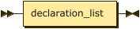

```
program  ::= declaration_list
```

**declaration_list:**


```
declaration_list
         ::= declaration+
```

referenced by:

* program

**declaration:**


```
declaration
         ::= function_decl
           | struct_decl
           | var_decl_stmt
```

referenced by:

* declaration_list

**function_decl:**


```
function_decl
         ::= normal_function_decl
           | extern_function_decl
```

referenced by:

* declaration

**normal_function_decl:**


```
normal_function_decl
         ::= 'funcion' type ID '(' param_list? ')' block
```

referenced by:

* function_decl

**extern_function_decl:**

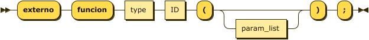

```
extern_function_decl
         ::= 'externo' 'funcion' type ID '(' param_list? ')' ';'
```

referenced by:

* function_decl

**param_list:**

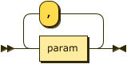

```
param_list
         ::= param ( ',' param )*
```

referenced by:

* extern_function_decl
* normal_function_decl

**param:**

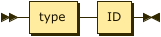

```
param    ::= type ID
```

referenced by:

* param_list

**struct_decl:**


```
struct_decl
         ::= 'estructura' ID '{' member_list '}' ';'
```

referenced by:

* declaration

**member_list:**


```
member_list
         ::= member+
```

referenced by:

* struct_decl

**member:**


```
member   ::= type ID ';'
```

referenced by:

* member_list

**var_decl_stmt:**

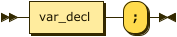

```
var_decl_stmt
         ::= var_decl ';'
```

referenced by:

* declaration
* statement

**var_decl:**

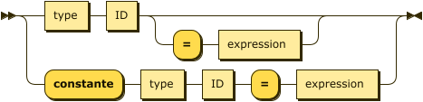

```
var_decl ::= type ID ( '=' expression )?
           | 'constante' type ID '=' expression
```

referenced by:

* for_init_opt
* var_decl_stmt

**type:**


```
type     ::= type_base '*'*
```

referenced by:

* extern_function_decl
* member
* new_expr
* normal_function_decl
* param
* var_decl

**type_base:**


```
type_base
         ::= 'vacio'
           | 'entero2'
           | 'entero4'
           | 'entero8'
           | 'caracter'
           | 'cadena'
           | 'flotante'
           | 'doble'
           | 'booleano'
           | 'con_signo'
           | 'sin_signo'
           | ID
```

referenced by:

* type

**statement:**


```
statement
         ::= var_decl_stmt
           | expr_stmt
           | if_stmt
           | while_stmt
           | for_stmt
           | return_stmt
           | break_stmt
           | continue_stmt
           | block
```

referenced by:

* for_stmt
* if_stmt
* statement_list
* while_stmt

**block:**


```
block    ::= '{' statement_list? '}'
```

referenced by:

* normal_function_decl
* statement

**statement_list:**


```
statement_list
         ::= statement+
```

referenced by:

* block

**expr_stmt:**


```
expr_stmt
         ::= expression? ';'
```

referenced by:

* statement

**if_stmt:**

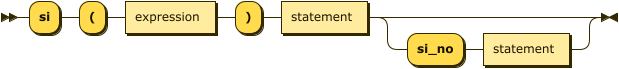

```
if_stmt  ::= 'si' '(' expression ')' statement ( 'si_no' statement )?
```

referenced by:

* statement

**while_stmt:**


```
while_stmt
         ::= 'mientras' '(' expression ')' statement
```

referenced by:

* statement

**for_stmt:**


```
for_stmt ::= 'para' '(' for_init_opt ';' expr_opt ';' expr_opt ')' statement
```

referenced by:

* statement

**for_init_opt:**


```
for_init_opt
         ::= ( var_decl | expression )?
```

referenced by:

* for_stmt

**expr_opt:**


```
expr_opt ::= expression?
```

referenced by:

* for_stmt

**return_stmt:**


```
return_stmt
         ::= 'retornar' expression? ';'
```

referenced by:

* statement

**break_stmt:**


```
break_stmt
         ::= 'romper' ';'
```

referenced by:

* statement

**continue_stmt:**


```
continue_stmt
         ::= 'continuar' ';'
```

referenced by:

* statement

**expression:**


```
expression
         ::= logical ( assignment_op logical )*
```

referenced by:

* argument_list
* expr_opt
* expr_stmt
* for_init_opt
* if_stmt
* postfix_op
* primary
* return_stmt
* var_decl
* while_stmt

**assignment_op:**


```
assignment_op
         ::= '='
           | '+='
           | '-='
           | '*='
           | '/='
           | '%='
```

referenced by:

* expression

**logical:**


```
logical  ::= logical_or
```

referenced by:

* expression

**logical_or:**


```
logical_or
         ::= logical_and ( '||' logical_and )*
```

referenced by:

* logical

**logical_and:**


```
logical_and
         ::= bitwise_or ( '&&' bitwise_or )*
```

referenced by:

* logical_or

**bitwise_or:**


```
bitwise_or
         ::= bitwise_xor ( '|' bitwise_xor )*
```

referenced by:

* logical_and

**bitwise_xor:**


```
bitwise_xor
         ::= bitwise_and ( '^' bitwise_and )*
```

referenced by:

* bitwise_or

**bitwise_and:**


```
bitwise_and
         ::= equality ( '&' equality )*
```

referenced by:

* bitwise_xor

**equality:**


```
equality ::= relational ( equality_op relational )*
```

referenced by:

* bitwise_and

**equality_op:**


```
equality_op
         ::= '=='
           | '!='
```

referenced by:

* equality

**relational:**


```
relational
         ::= additive ( relational_op additive )*
```

referenced by:

* equality

**relational_op:**

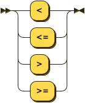

```
relational_op
         ::= '<'
           | '<='
           | '>'
           | '>='
```

referenced by:

* relational

**additive:**

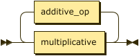

```
additive ::= multiplicative ( additive_op multiplicative )*
```

referenced by:

* relational

**additive_op:**


```
additive_op
         ::= '+'
           | '-'
```

referenced by:

* additive

**multiplicative:**


```
multiplicative
         ::= unary ( multiplicative_op unary )*
```

referenced by:

* additive

**multiplicative_op:**


```
multiplicative_op
         ::= '*'
           | '/'
           | '%'
```

referenced by:

* multiplicative

**unary:**


```
unary    ::= unary_op* postfix
```

referenced by:

* delete_expr
* multiplicative

**unary_op:**


```
unary_op ::= '!'
           | '-'
           | '++'
           | '--'
           | '*'
           | '&'
```

referenced by:

* unary

**postfix:**


```
postfix  ::= primary postfix_op*
```

referenced by:

* unary

**postfix_op:**


```
postfix_op
         ::= '++'
           | '--'
           | ( '.' | '->' ) ID
           | '[' expression ']'
           | '(' argument_list? ')'
```

referenced by:

* postfix

**argument_list:**

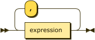

```
argument_list
         ::= expression ( ',' expression )*
```

referenced by:

* postfix_op

**primary:**


```
primary  ::= ID
           | ENTERO
           | FLOT
           | CARACTER
           | CADENA
           | '(' expression ')'
           | new_expr
           | delete_expr
```

referenced by:

* postfix

**new_expr:**

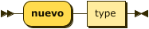

```
new_expr ::= 'nuevo' type
```

referenced by:

* primary

**delete_expr:**


```
delete_expr
         ::= 'eliminar' unary
```

referenced by:

* primary

**ID:**


```
ID       ::= LETRA ( LETRA | DIGITO | '_' )*
```

referenced by:

* extern_function_decl
* member
* normal_function_decl
* param
* postfix_op
* primary
* struct_decl
* type_base
* var_decl

**ENTERO:**


```
ENTERO   ::= DECIMAL
           | HEXADECIMAL
```

referenced by:

* primary

**DECIMAL:**


```
DECIMAL  ::= DIGITO+
```

referenced by:

* ENTERO

**HEXADECIMAL:**


```
HEXADECIMAL
         ::= '0' ( 'x' | 'X' ) HEX_DIGITO+
```

referenced by:

* ENTERO

**FLOT:**


```
FLOT     ::= DIGITO* ( DIGITO '.' | '.' DIGITO ) DIGITO* EXPONENTE?
```

referenced by:

* primary

**EXPONENTE:**


```
EXPONENTE
         ::= ( 'e' | 'E' ) ( '+' | '-' )? DIGITO+
```

referenced by:

* FLOT

**CARACTER:**


```
CARACTER ::= "'" ( ESCAPE_CHAR | CHAR_NO_ESPECIAL ) "'"
```

referenced by:

* primary

**CADENA:**


```
CADENA   ::= '"' ( ESCAPE_CHAR | STRING_CHAR )* '"'
```

referenced by:

* primary

**ESCAPE_CHAR:**


```
ESCAPE_CHAR
         ::= '\\' ( 'n' | 't' | 'r' | '\\' | "'" | '"' | '0' )
```

referenced by:

* CADENA
* CARACTER

**LETRA:**


```
LETRA    ::= [a-zA-Z]
```

referenced by:

* ID

**DIGITO:**


```
DIGITO   ::= [0-9]
```

referenced by:

* DECIMAL
* EXPONENTE
* FLOT
* ID

**HEX_DIGITO:**


```
HEX_DIGITO
         ::= [0-9a-fA-F]
```

referenced by:

* HEXADECIMAL

**CHAR_NO_ESPECIAL:**

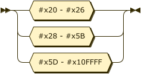

```
CHAR_NO_ESPECIAL
         ::= #x20 - #x26
           | #x28 - #x5B
           | #x5D - #x10FFFF
```

referenced by:

* CARACTER

**STRING_CHAR:**


```
STRING_CHAR
         ::= #x20 - #x21
           | #x23 - #x5B
           | #x5D - #x10FFFF
```

referenced by:

* CADENA

## 
 <sup>generated by [RR - Railroad Diagram Generator][RR]</sup>

[RR]: https://www.bottlecaps.de/rr/ui